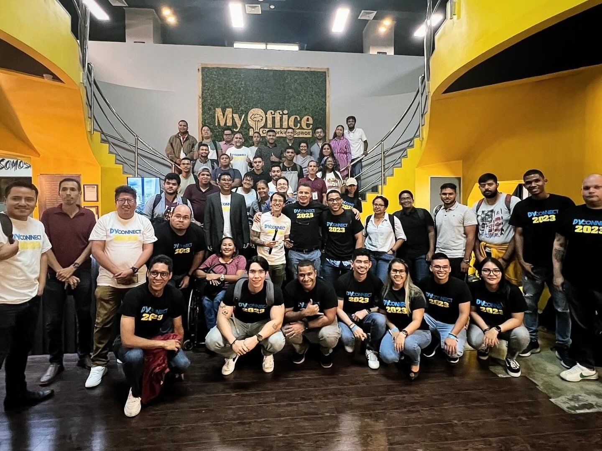

# Antecedentes
Desde una edad temprana, he sido apasionado por la tecnología. Con el tiempo, mis intereses evolucionaron desde las redes informáticas y la ciberseguridad al análisis y ciencia de datos, donde encontré mi verdadera motivación. Durante la universidad, mis cursos favoritos incluyeron metodologías de investigación, estadística, sistemas expertos y análisis de datos, lo que solidificó aún más mi compromiso con este campo. Actualmente, programo en Python y C++, desarrollando herramientas para optimizar tareas personales y participando en proyectos que facilitan el aprendizaje continuo.

# Experiencia

Obtuve una licenciatura en Ingeniería de Sistemas y Computación en la Universidad Tecnológica de Panamá. Adquirí experiencia a través de proyectos colaborativos, lo que perfeccionó mis habilidades en análisis de datos y resolución de problemas. Durante los últimos años de la universidad, realicé algunos trabajos paralelos programando y enseñando a estudiantes universitarios.

Entre 2022 y 2024, trabajé para Credicorp Bank como Analista de Seguridad Informática en las siguientes tareas:

* Investigaciones de fraude, evaluaciones de vulnerabilidades, informes interactivos y dashboards utilizando Power BI
* Administrar y mantener las bases de datos del departamento
* Desarrollo e implementación de pipelines para analizar patrones de fraude en entornos locales y en la nube
* Automatización de tareas de seguridad e Infraestructura como Código (IaC) utilizando Python
* Configuración de políticas de seguridad, Gestión de Identidad y Acceso (IAM), detección y respuesta a incidentes, y seguridad de infraestructura en AWS y Azure

Actualmente, estoy cursando una maestría en Ciencias de Analítica de Datos en la Universidad Tecnológica de Panamá y preparándome para una certificación en la nube. Planeo enfocar mi carrera en ciencia de datos. Tengo la intención de participar en comunidades tecnológicas, asistir a hackathons y talleres para expandir mis conocimientos, y establecer redes de contacto con profesionales del campo.

# Hobbies
En mi tiempo libre, me encanta jugar videojuegos, estar al tanto de las últimas tecnologías y escribir pequeños scripts para hacer las tareas diarias más fáciles.