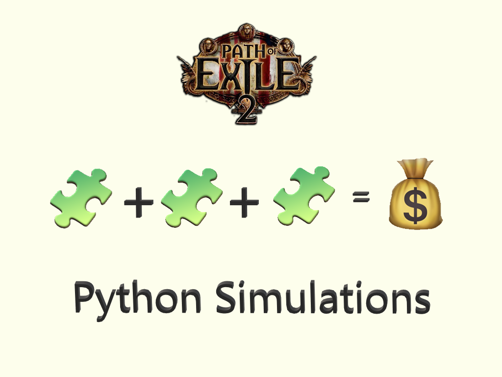
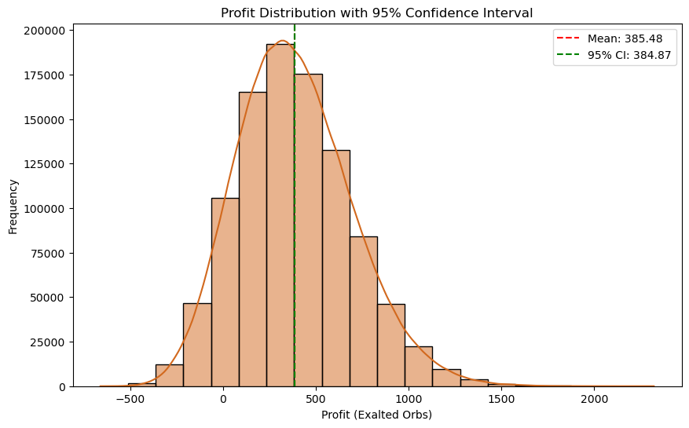

  

## **El Contexto: ¿Por Qué Hice Esto?**  
Llevo un mes jugando este nuevo juego (Path of Exile 2) y, para enfrentar el contenido más difícil, necesitas equipo de alta calidad. Para conseguirlo, necesitas una Superior cantidad de moneda dentro del juego. ¿El problema? La economía es caótica. Los jugadores descubren constantemente nuevas formas de obtener moneda, pero en cuanto un método se vuelve popular, deja de ser rentable.  

Como alguien apasionado por la programación y los datos (y tal vez que pasa demasiado tiempo pensando en hojas de cálculo), pensé:  
> "¿Por qué no usar mis habilidades de programación para encontrar la mejor forma de hacer moneda?"  

Así que me propuse simular estrategias de conversión de moneda en el juego, centrándome específicamente en la refundición de esencias para determinar si podía encontrar un patrón rentable. Por ejemplo, obtener esencias de nivel superior que se vendan por la mayor cantidad de moneda (Orbes Exaltados).  

---

## **El Problema: Refundición de Esencias en PoE**  
En PoE, las "Esencias" son materiales de creación que pueden refundirse en versiones de nivel superior. ¿El truco? Las tasas de éxito son bajas y los resultados son aleatorios. Mi pregunta era simple:  
> Si refundiera miles de esencias, ¿obtendría ganancias o me arruinaría?  

Para responder esto, construí un simulador en Python que modela el proceso, incorporando:  
1. **Probabilidades de conversión**: Una tasa de éxito del 2.26% para mejoras a un nivel superior (según datos de la comunidad).  
2. **Precios de mercado**: Valores en Orbes Exaltados para cada tipo de esencia (spoiler: Superior Esencia de Celeridad = $$$).  
3. **Recursos protegidos**: Algunas esencias de nivel bajo (como Electricidad) son demasiado valiosas para refundirlas.  

---

## **Construyendo el Simulador**  
### **1. Modelando la Economía**  

**Limitaciones del Mundo Real**  
La refundición de esencias tiene restricciones que afectan la simulación:  
1. **Espacio de Inventario**: Los jugadores tienen un almacenamiento limitado en el inventario y el baúl.  
2. **Volatilidad del Mercado**: Las esencias baratas son escasas en grandes cantidades y los precios fluctúan rápidamente.  
3. **Impuestos**: Se aplica un impuesto en oro a las transacciones del mercado.  
4. **Tiempo**: La refundición consume tiempo, y los cambios en el mercado pueden borrar las ganancias.  

**Diseño de la Simulación**  
Para reflejar estos desafíos, el simulador:  
- Ejecuta **100,000 intentos de inversión independientes** (sin refundiciones infinitas).  
- Cada intento consiste en **1,000 refundiciones** como mínimo. Esto representa una inversión asequible, un espacio de inventario razonable, impuestos en oro y tiempo consumido (25 minutos).  
- Rastrea métricas como ganancia promedio, rachas de pérdidas y retornos ajustados al riesgo.  

**Parámetros Clave**  
- **Inversión**: 1,300 Orbes Exaltados (evita la ruina en el 95% de los escenarios).  
- **Entrada de Esencias**: 3,000 esencias de nivel bajo (2.3 Exaltados cada una).  
- **Mecánica**:  
  - **Éxito (2.26%)**: Se obtiene una esencia de nivel superior aleatoria.  
  - **Fracaso**: Se recibe una esencia menor aleatoria (excluyendo Electricidad/Celeridad protegidas).  

```python
# Simplified simulation loop
while reforges_possible:
    consume_3_essences()
    if success(probability=0.0226):
        reward = random_greater_essence()
    else:
        refund = random_minor_essence()
```

### **2. Significancia Estadística**  
En PoE, la refundición es un juego de extremos. La mayoría de las refundiciones otorgan una esencia de nivel bajo, pero algunas pueden recompensarte con esencias de alto valor como **Superior Esencia de Celeridad** (vale 186 Exaltados) o **Superior Esencia del Infinito** (vale 96 Exaltados).  

Aquí está el problema:  
- **Celeridad tiene una tasa de obtención del 0.1%**. En promedio, necesitarías hacer 1,000 refundiciones solo para ver *una* Superior Esencia de Celeridad.  
- **Infinito tiene una tasa de obtención del 0.25%**. Un poco mejor, pero sigue siendo rara.  

En mis primeras simulaciones, estos eventos raros distorsionaban los resultados. Una sola gota de Celeridad podía hacer que un intento pareciera increíblemente rentable, mientras que una racha de mala suerte podía acabar con todo mi capital. Esto hacía imposible obtener conclusiones significativas, incluso con 100,000 intentos.  

#### **El Punto de Inflexión: Escalando la Simulación**  
Para obtener resultados confiables, me di cuenta de que necesitaba simular *muchas más refundiciones*.  

1. **Ley de los Grandes Números**:  
   - Cuantos más ensayos realices, más cerca estarán tus resultados de las verdaderas probabilidades.  
   - Con 100,000 intentos (100 millones de refundiciones), podría ver ~100,000 gotas de Celeridad. Pero con **1 millón de intentos (1,000 millones de refundiciones)**, esperaría ~1,000,000 gotas de Celeridad, lo que daría una imagen mucho más clara de su impacto.  

2. **Reducción de la Varianza**:  
   - Las muestras pequeñas son ruidosas. Al aumentar la escala, pude suavizar la aleatoriedad y observar las tendencias subyacentes.  

3. **Captura de Eventos Raros**:  
   - Eventos raros como las gotas de Celeridad dominan la distribución de ganancias. Sin suficientes pruebas, su impacto se sobrestima o se subestima.  


Así que amplié a **1 millón de simulaciones**.

## **Resultados**

Ganancia promedio por intento: 385 Exalted (IC 95%: 384–386)




### **1. Desglose de ganancias por tipo de esencia**  

La Esencia Menor de Electricidad es el mayor contribuyente, representando el 30% de la ganancia total, seguida por la Esencia Mayor del Infinito y la Esencia Mayor de Celeridad, con un 18% y 15% respectivamente. A pesar de ser clasificada como una esencia menor, la Esencia Menor de Electricidad tiene un impacto mayor que varias esencias mayores.

|    | Esencia                      | Contribución a la Ganancia |
|---:|:-----------------------------|--------------------------:|
|  1 | Esencia Menor de Electricidad |   30%  |
|  2 | Esencia Mayor del Infinito    |   18%  |
|  3 | Esencia Mayor de Celeridad    |   15%  |
|  4 | Esencia Mayor de la Mente     |    7%  |
|  5 | Esencia Mayor de Electricidad |    6%  |
|  6 | Esencia Mayor de Hechicería   |    6%  |
|  7 | Esencia Mayor del Tormento    |    4%  |
|  8 | Esencia Menor de Celeridad    |    3%  |
|  9 | Esencia Mayor de Mejora       |    2%  |
| 10 | Esencia Mayor de Batalla      |    1%  |


### **2. Probabilidad de Pérdida**

**Fórmula:** \\(\text{Probabilidad de Pérdida} = \frac{\text{Intentos Perdidos}}{\text{Intentos Totales}} \\)

\\(\text{Probabilidad de Pérdida} = 9.8\\% \\)

### **3. Ratio de Ganancias/Pérdidas**  
**Fórmula**: \\( \text{Ratio WL} = \frac{\text{Probabilidad de Ganancia}}{\text{Probabilidad de Pérdida}} \\)  

\\( \text{Ratio WL} = 9.20 \\)

### **4. Valor en Riesgo (VaR)**  

**Fórmula:**  \\( \text{VaR} = \text{Percentil de Pérdidas al Nivel de Confianza} \\)

\\( \text{VaR}_{95\\%}= 86.85 \text{ Exalted Orbs} \\)

### **5. Retorno Ajustado al Riesgo (Ratio de Sharpe)**  


**Fórmula:**  \\(\text{Ratio de Sharpe} = \frac{\text{Ganancia Promedio}}{\text{Desviación Estándar de la Ganancia}} \\)

\\(\text{Ratio de Sharpe} = 1.24 \\)


### **6. Valor Esperado (EV) por Intento**


**Fórmula:** \\({EV} = (\text{Ganancia Promedio} \times \text{Probabilidad de Ganancia}) - (\text{Pérdida Promedio} \times \text{Probabilidad de Pérdida}) \\)

\\({EV} = 358.68 \text{ Exalted Orbs } \\)


## **Conclusión**  

Después de simular **1 millón de intentos de refundición** (1 billón de refundiciones), los resultados son claros: refundir esencias en *Path of Exile 2* es una **estrategia de bajo riesgo y alta recompensa**, pero solo si estás dispuesto a pasar 30 minutos repitiendo la misma tarea. Esto es lo que nos dicen los números:  

1. **Rentabilidad**:  
   - **Ganancia Promedio**: 385 Exalted por intento (IC 95%: 384–386).  
   - **Ratio de Ganancia/Pérdida**: 9.2 (90.2% tasa de ganancia vs. 9.8% tasa de pérdida).  
   - **Valor Esperado**: 358.68 Exalted por intento.  

2. **Gestión del Riesgo**:  
   - **Ratio de Sharpe**: 1.24.  
   - **Valor en Riesgo (VaR)**: El 95% de los intentos pierde <86.85 Exalted.  

3. **Factores Clave**:  
   - **Esencias de Electricidad**: Contribuyeron al 30% de las ganancias totales.  
   - **Celeridad & Infinito**: Representaron el 33


---

**¡Gracias por leer!** Si tienes alguna pregunta o comentario, no dudes en contactarme. Aprecio mucho tu retroalimentación.

---

Keywords: Python, Simulation, Path of Exile 2, Poe2

---