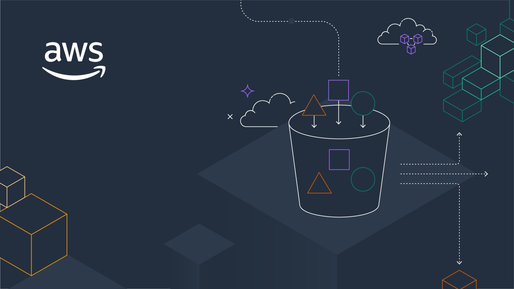
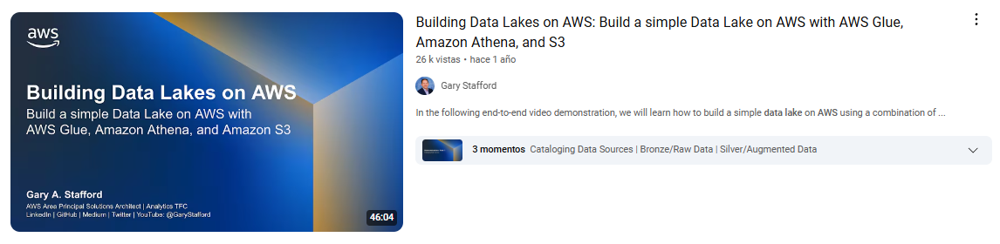
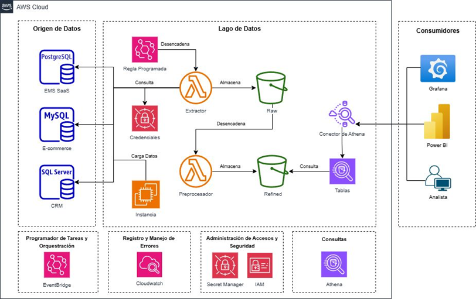
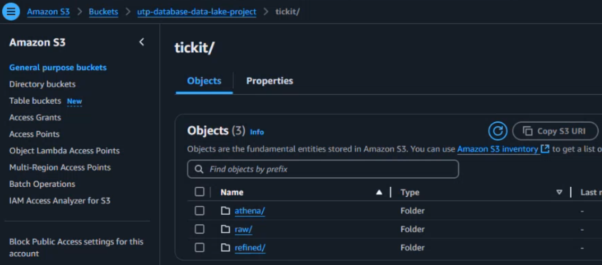
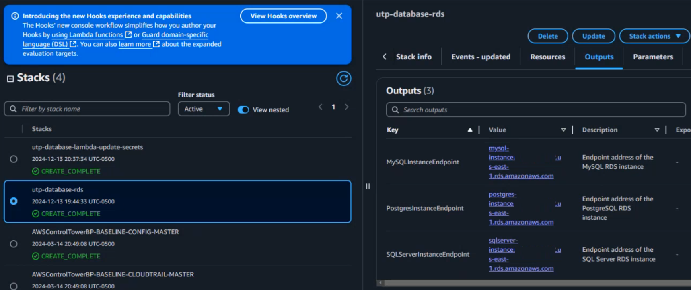
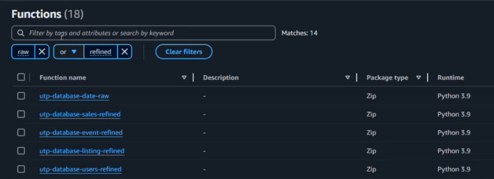
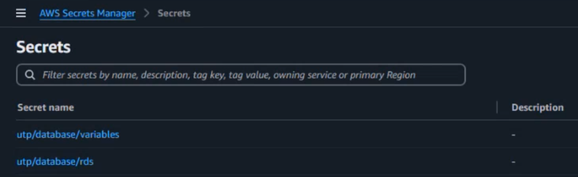
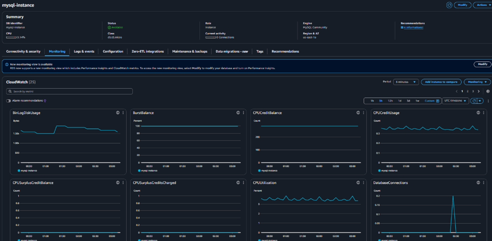
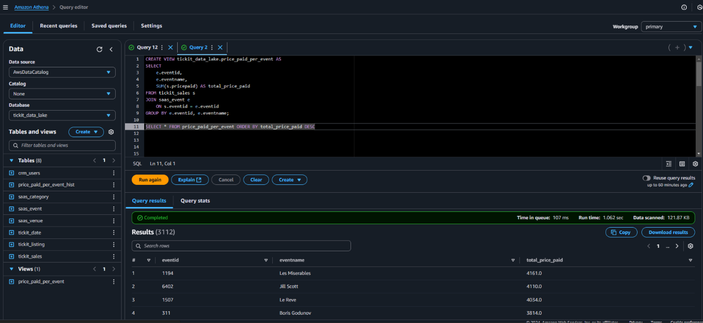
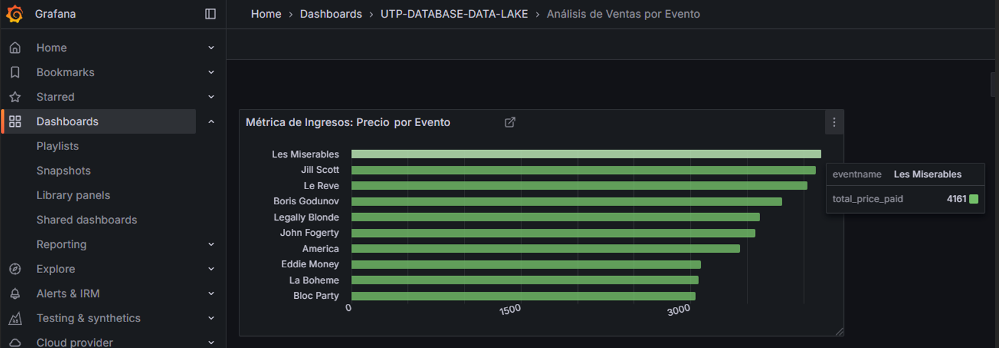

# **Introduction**  

Data is the foundation of decision-making in today’s digital world. From detecting fraud to optimizing business operations, organizations rely on efficient data pipelines to ingest, process, and analyze vast amounts of information. But managing these pipelines at scale requires more than just traditional databases, it demands a robust, scalable architecture.  

This project was born from a course I took during my master’s in Data Analytics, specifically on **Advanced Database Systems**, where we set out to design and deploy a **Data Lake on AWS**. The goal? To build a system capable of seamlessly integrating data from multiple sources while ensuring **efficiency, automation, and scalability**. Rather than just setting up services, I focused on structuring a pipeline that could handle real-world data challenges such as processing structured and semi-structured data, automating ingestion, and optimizing costs.  

In this blog, I’ll walk you through my journey, along the way, I’ll highlight key lessons learned, trade-offs in architectural decisions, and improvements I’d make in future iterations. 

---

# **Background and Context**  

For our final project, we were given **two options** by our instructor:  

1️⃣ **Option A** → Develop an **advanced query system** that interacts with multiple databases in the cloud.  
2️⃣ **Option B** → **Build a Data Lake in AWS**, following an end-to-end architecture demonstrated in a reference video.  

The video, [**Building Data Lakes on AWS**](https://youtu.be/LAovcGquDc4?si=XxqlKeQLFqRuHaIb), provided a step-by-step guide to setting up a Data Lake using services like **AWS Glue, Athena, and S3**. However, the instructor made it clear that we were **not required to replicate the video exactly**, giving us the flexibility to modify the implementation as needed.  

We decided to go with **Option B**, but we wanted to **avoid AWS Glue** to eliminate costs during development. This required additional changes, such as replacing Glue with other AWS services and setting up a **scheduler** to automate data processing. These modifications introduced new technical challenges and added complexity to the development process.  



---

# **Project Overview**  

At its core, this project was about **building a cloud-based Data Lake using AWS**. But what does that mean in practice? Here’s a high-level breakdown:  

- **Data Storage**: An **AWS S3 bucket** serves as the main repository for incoming database data.  
- **Database Infrastructure**: Multiple databases (MySQL, SQL Server, and PostgreSQL) are deployed using **Amazon RDS**.  
- **Cost Management with CloudFormation**: CloudFormation templates were used to **deploy and delete databases daily** during development. This approach helped minimize costs while the project was still evolving.  
- **ETL Processing**: AWS Lambda functions handle the **Extract, Transform, Load (ETL)** processes to clean and move data.  
- **Orchestration**: **Amazon EventBridge** triggers and schedules Lambda functions to process data efficiently.  
- **Security**: AWS Secrets Manager ensures safe handling of database credentials.  

### **Challenges & Learnings**  
Like any technical project, this one came with its fair share of challenges:  
- Setting up secure connections between RDS instances and Lambda functions.  
- Optimizing costs by leveraging AWS **free tier** resources.  
- Automating the entire workflow while maintaining flexibility for future changes.  

By the end, I had a functional **Data Lake architecture**, capable of ingesting data from multiple sources and preparing it for analysis. It’s not perfect, but it’s a solid foundation.  




---


# **The Personal Journey**  

Every project has a technical side, but there’s always a personal journey behind the code. This project was no exception.  

## **How It Started**  

Setting up a **Data Lake on AWS** was a great opportunity to work with multiple AWS services in a structured way. I was already familiar with AWS, but this project required integrating multiple services while keeping costs low. It was the perfect chance to **learn, break things, and figure out how to make them work** in a real-world scenario.  

AWS documentation is useful, but it often focuses on **how** to configure services rather than **why** certain decisions matter. Instead of just following guides, we tested different setups to find the best approach for our project. This hands-on experimentation helped us refine our architecture, troubleshoot issues, and make well-informed choices.  

## **Key Challenges & How We Overcame Them**  

### **Database Connectivity Issues**  

Before launching AWS RDS, we tested connectivity with our existing databases on **Azure and MongoDB**. This early testing helped us verify database interactions, but due to time constraints, we decided to host everything in **Amazon RDS** for consistency.  

The next challenge came when configuring **VPC networking**. Running Lambda inside a VPC required setting up proper security groups, subnets, and NAT gateways. To debug network access, we launched an **EC2 instance inside the VPC** and used it to test connections to RDS. This helped us quickly identify and adjust security rules, allowing smooth database communication.  

##### **Solution**  
- Used an **EC2 instance inside the VPC** to test connections before deploying Lambda functions.  
- Configured **security groups and subnet routing** to allow Lambda functions to access RDS securely.  
- Ensured proper **IAM roles and VPC endpoints** were in place for efficient database interaction.  

---

### **Automating Infrastructure with CloudFormation**  

I had previous experience with **CloudFormation**, so deploying resources through templates wasn’t a challenge. However, the main issue was ensuring **database configurations worked with AWS low tier instances**. Some RDS parameter settings weren’t compatible with low-tier instances, causing deployment failures.  

##### **Solution**  
- Adjusted **database parameter groups** to match tier limitations.  
- Iteratively deployed CloudFormation stacks to identify **resource compatibility issues**.  

This approach allowed us to deploy databases quickly and **delete them after daily development** to keep costs low.  

---

### **ETL Processing & Event Scheduling**  

The main challenge with AWS Lambda was setting up **custom layers** for handling database queries. We needed external Python libraries, but we encountered local machine limitations, layer size limits and library compatibility issues.

To solve this, we used our **EC2 instance** to build the Lambda layer, ensuring all dependencies were properly packaged. The layer was then uploaded to **S3** and linked to the Lambda functions.  

##### **Solution**  
- Built the **Lambda layer** in an EC2 instance to handle package dependencies.  
- Compressed and uploaded the layer to **S3** for easy reuse.  
- Adjusted **Lambda function memory and timeout settings** for better performance.  

Once the Lambda functions were running efficiently, we scheduled them using **Amazon EventBridge** to automate the ETL pipeline.  

---

## **What I Would Improve Next Time**  

🔹 **More automation**: While CloudFormation helped, incorporating **Terraform** might provide even greater flexibility in infrastructure management.  
🔹 **Logging & monitoring**: Adding **AWS CloudWatch alerts** would improve visibility into failures and system performance.  

---

# **Technical Deep Dive**  

Now that we’ve covered the journey, let’s get into the **nitty-gritty** of how this Data Lake was built. This section will break down each major component, from **data ingestion** to **processing and storage**, highlighting key configurations and best practices along the way.  

---

## **Data Ingestion: Setting Up AWS S3 as the Data Lake**  

The first step in building a Data Lake is defining where data will be stored. In this case, **Amazon S3** serves as the foundation, acting as a scalable, cost-effective storage solution.  

### **Creating the S3 Bucket**  
To set up the **Data Lake bucket**, I used the AWS console and followed best practices:  

- **Disabled ACLs** → Ensures all objects remain owned by my account.  
- **Blocked public access** → Prevents unintended data exposure.  
- **Versioning enabled** → Maintains historical versions of objects in case of errors.  
- **Default encryption (AES-256)** → Protects data at rest.  

```bash
aws s3api create-bucket --bucket utp-database-data-lake-project --region us-east-1
```

Once the bucket was created, it became the central repository for data ingestion. **All raw data from multiple databases (MySQL, SQL Server, and PostgreSQL) was first stored here before further processing.**  



---

## **Infrastructure as Code: AWS CloudFormation**  

Manually provisioning databases and networking resources is inefficient, so I automated the process using **AWS CloudFormation**. CloudFormation allows you to define infrastructure in a **YAML template**, making deployments **repeatable and scalable**.  

### **Database Stack (RDS Instances)**  
I modified an AWS-provided CloudFormation template to deploy three **Amazon RDS** instances:  

- **MySQL** (for e-commerce transactions)  
- **SQL Server** (for CRM data)  
- **PostgreSQL** (for enterprise management data)  

Each database instance had the following configuration:  

- **Instance type:** `db.t3.micro` 
- **Storage:** 20GB  
- **Security:** IAM role integration with **AWS Secrets Manager** for credential storage  
- **Networking:** Private subnet with VPC security groups  

```yaml
Resources:
  MySQLInstance:
    Type: AWS::RDS::DBInstance
    Properties:
      DBInstanceIdentifier: mysql-instance
      DBName: db_mysql
      DBInstanceClass: db.t3.micro
      AllocatedStorage: 20
      Engine: MySQL
      EngineVersion: "8.0.39"
      MasterUsername: 
        Fn::Sub: "{{resolve:secretsmanager:arn:aws:secretsmanager:us-east-1:123456789:secret:utp/database/rds-ASDAS:SecretString:MySQLDBUsername}}"
```

Once deployed, the **CloudFormation Outputs** section provided **endpoints for connecting** to each database instance.  



---

## **Data Processing with AWS Lambda (ETL Pipelines)**  

Extracting, transforming, and loading (ETL) data efficiently is crucial for a well-functioning Data Lake. AWS Lambda was used to **automate data extraction, process raw data, and store refined versions** in S3.  

### **ETL Workflow**  
Each Lambda function was responsible for a different step in the ETL pipeline:  

1. **Extract data from RDS**  
2. **Transform raw records into structured formats (Parquet, CSV)**  
3. **Load processed data back into S3**  

```python
import os
import json
import logging
from io import BytesIO

import pymysql
import boto3
from botocore.exceptions import ClientError
import pandas as pd

# Setup logging
logger = logging.getLogger()
logger.setLevel(logging.INFO)

# Initialize AWS clients
secrets_client = boto3.client('secretsmanager', region_name='us-east-1')
s3_client = boto3.client('s3')

# Retrieve configuration from environment variables
SECRET_ARN = os.environ.get('SECRET_ARN')

def lambda_handler(event, context):
    try:
        # Retrieve database credentials
        creds = get_db_credentials(SECRET_ARN)
        endpoint = creds['MySQLODBEndpoint']

        # Query the database and obtain the result as a pandas DataFrame
        df = query_database(endpoint, creds)
...
```

### **Event-Driven Processing**  
- AWS **EventBridge** was used to **trigger Lambda functions** every 5 minutes, ensuring near real-time data updates.  
- Each Lambda function **processed a different table**, ensuring modularity.  
- Processed data was **stored in an S3 "Refined" bucket**, ready for analysis.  



---

## **Security & Credential Management with AWS Secrets Manager**  

Storing database credentials in code is risky. To enhance security, **AWS Secrets Manager** was used to store RDS credentials securely.  

**Steps Taken:**  
1. Created a secret for each database instance.  
2. Restricted access using **AWS IAM policies** (only Lambda functions could retrieve credentials).  
3. Enabled **automatic credential rotation** for better security.  

```json
{
  "SecretId": "rds-secret",
  "Database": "MySQL",
  "Username": "admin",
  "Password": "securepassword"
}
```



---

## **Data Governance: Monitoring & Logging with CloudWatch**  

Keeping track of **ETL job failures** and **database health** was essential. AWS **CloudWatch Logs** helped monitor:  

- **Lambda execution success/failure rates**  
- **Query execution times & potential bottlenecks**  
- **Database CPU and memory utilization**  

### **Setting Up CloudWatch Alarms**  
CloudWatch was configured to send **email alerts** if:  
✅ A Lambda function failed **more than 3 times in a row**  
✅ An RDS instance exceeded **80% CPU usage for more than 5 minutes**  

```yaml
Resources:
  LambdaErrorAlarm:
    Type: AWS::CloudWatch::Alarm
    Properties:
      AlarmName: LambdaErrorCount
      MetricName: Errors
      Namespace: AWS/Lambda
      Statistic: Sum
      Period: 60
      EvaluationPeriods: 3
      Threshold: 3
      AlarmActions:
        - !Ref SNSAlertTopic
```



---

## **Data Querying & Analysis: AWS Athena & Visualization Tools**  

Once data was stored in the **Refined S3 Bucket**, it needed to be **easily accessible for analysis**. Instead of setting up a traditional data warehouse, **AWS Athena** was used to run SQL queries **directly on S3 data**.  

### **Defining the Athena Table**  
```sql
CREATE EXTERNAL TABLE IF NOT EXISTS tickit_sales (
    salesid INT,
    listid INT,
    sellerid INT,
    buyerid INT,
    eventid INT,
    dateid SMALLINT,
    qtysold SMALLINT,
    pricepaid DOUBLE,
    commission DOUBLE,
    saletime STRING,
    refined_timestamp TIMESTAMP
)
STORED AS PARQUET
LOCATION 's3://utp-database-data-lake-project/tickit/refined/sales/';
```


Now, data could be queried instantly using standard SQL.  

### **Connecting to BI Tools**  
The final step was integrating Athena with **Power BI & Grafana** for real-time visualizations.  



---

## **Wrapping Up the Tech Stack**  

By the end of the project, the full architecture looked like this:  

1️⃣ **AWS S3** → Stores raw & processed data.  
2️⃣ **AWS RDS (MySQL, SQL Server, PostgreSQL)** → Databases feeding the Data Lake.  
3️⃣ **AWS CloudFormation** → Automates database & infrastructure setup.  
4️⃣ **AWS Lambda** → Runs ETL jobs for data transformation.  
5️⃣ **AWS EventBridge** → Automates ETL scheduling.  
6️⃣ **AWS Secrets Manager** → Manages database credentials securely.  
7️⃣ **AWS CloudWatch** → Monitors system health & logs failures.  
8️⃣ **AWS Athena** → Enables SQL querying on S3 data.  
9️⃣ **Power BI / Grafana** → For reporting & monitoring.  

---


# **Lessons Learned and Future Directions**  

Every project brings a mix of successes and challenges. Some things work exactly as planned but that’s where the best learning happens. This section dives into my biggest takeaways from building the AWS-based Data Lake and what I would do differently next time.  

---

## **Key Lessons Learned**  


#### **1. Managing costs in AWS requires careful planning**  
I realized that **poor resource allocation** can drive up costs fast. Keeping unused RDS instances running can lead to unnecessary expenses.  

✅ **Takeaway:**  
- Use **AWS Cost Explorer** to monitor spending in real time.  
- Leverage **S3 lifecycle policies** to automatically move old data to Glacier.  
- Consider **on-demand vs. reserved instances** for RDS if running long-term projects.  

---

#### **2. ETL pipelines should be more modular**  
Initially, each **AWS Lambda function** handled a different data extraction process, but as I added more databases, managing multiple ETL functions became complex. If one function failed, debugging became a nightmare.  

✅ **Takeaway:**  
- Instead of multiple small Lambda functions, consider **orchestrating ETL workflows** with **AWS Step Functions** for better error handling.  
- Use **Amazon Glue** instead of Lambda for large-scale ETL workloads.  

---

#### **3. Logging and Monitoring are lifesavers**  
AWS CloudWatch logs helped me debug **ETL job failures** and **database connectivity issues**. 

✅ **Takeaway:**  
- Set up **CloudWatch Alarms** to get notified of failures.  
- Use **Athena query logs** to optimize performance and avoid slow queries.  

---

## **Future Improvements and Next Steps**  

This project was a great learning experience, but there are a few things I’d improve or expand on in the future:  

#### 1. **Replace Lambda ETL with AWS Glue**  
AWS Glue is **serverless, scalable, and better suited for complex ETL tasks**. Moving from Lambda to Glue would reduce complexity and provide better schema management.  

#### 2. **Implement Data Lake Permissions with AWS Lake Formation**  
Right now, S3 stores all the data, but there’s no fine-grained access control. AWS **Lake Formation** would allow better **permissions management** by setting **role-based access policies** on stored datasets.  

#### 3. **Automate More with Terraform**  
CloudFormation was great, but **Terraform** offers **multi-cloud compatibility** and more flexibility. Migrating infrastructure automation to Terraform would make deployments even smoother.  

####  4. **Expand Data Visualization with Amazon QuickSight**  
I used **Power BI and Grafana**, but **Amazon QuickSight** could be a better alternative for integrating directly with AWS.  

---

# **Conclusion**  

In this project, I’ve shared our approach to building a scalable data lake on AWS and the lessons I learned along the way. A special thanks to my friends [**Andy Sanjur**](https://www.linkedin.com/in/andy-sanjur-dom%C3%ADnguez-6aa786140), [**Harris Yearwood**](https://www.linkedin.com/in/harris-yearwood/) and [**Isaac Ávila**](https://www.linkedin.com/in/isaaldair/) for their contributions and support throughout this journey.

Along the way, we faced several **challenges** debugging network issues, optimizing cost efficiency, and improving security measures. But in overcoming them, we gained **valuable hands-on experience** with AWS services and infrastructure as code (IaC).  

---

## **Final Thoughts & Takeaways**  

✅ **Cloud infrastructure requires a balance between automation and flexibility**  
Using CloudFormation simplified deployment, but fine-tuning configurations required manual intervention. Next time, I’d explore **Terraform** for more flexibility.  

✅ **ETL pipelines should be scalable and maintainable**  
Lambda worked for small-scale ETL, but **AWS Glue** would be a better long-term solution. **Step Functions** could also improve error handling.  

✅ **Cost optimization is an ongoing process**  
Even within the free tier, AWS costs can spiral if not monitored. Tools like **Cost Explorer** and **S3 lifecycle policies** help control expenses.  

✅ **Security should be a priority from the start**  
Storing credentials in **AWS Secrets Manager**, implementing **IAM role-based permissions**, and blocking public access to S3 were key security measures.  

---

Thank you for reading! If you have any questions or comments, please feel free to contact me. Your feedback is highly appreciated.

---

**Keywords:** AWS, Data Lake, Cloud Computing, Database Systems, ETL, CloudFormation, S3, RDS, Lambda, Data Engineering  

---