Predecir el churn de clientes no se trata solo de identificar quién es probable que se vaya; se trata de comprender las implicaciones financieras detrás de la salida de cada cliente. Además, una de las complejidades en la predicción del churn es lidiar con conjuntos de datos desbalanceados, donde el número de clientes que no se van supera ampliamente a los que se van.

Hoy, construiré un modelo de predicción de churn de clientes sensible al costo usando aprendizaje automático. Profundizaré en la exploración de datos, ingeniería de características, entrenamiento del modelo y evaluación, con el objetivo de minimizar las pérdidas financieras asociadas con el churn de clientes. Al mismo tiempo, analizaré el desempeño de un modelo de clasificación durante un escenario de conjunto de datos desbalanceado.

## Introducción

El churn de clientes es una métrica crítica para las empresas, especialmente en industrias como telecomunicaciones, banca y servicios basados en suscripciones. Los modelos de predicción de churn ayudan a identificar a los clientes que probablemente dejen de usar los productos o servicios de una empresa. Al abordar proactivamente el churn, las empresas pueden implementar estrategias de retención dirigidas, ahorrando ingresos significativos.

Los modelos tradicionales de predicción de churn a menudo se enfocan únicamente en la precisión, descuidando las ramificaciones financieras de los diferentes tipos de errores de predicción. Por ejemplo, el costo de predecir incorrectamente que un cliente leal se irá (falso positivo) es diferente de no identificar a un cliente que realmente se va (falso negativo). Para abordar esto, adopto un **enfoque sensible al costo** que incorpora los costos comerciales asociados con cada tipo de error directamente en el modelo.

En este post, construiré un modelo de predicción de churn que considere estos costos. Además, abordaré el problema del **desbalanceo de clases**, donde la mayoría de los datos son de clientes que no se van. Un desbalance de este tipo puede hacer que el modelo pase por alto a los verdaderos clientes que se van, lo cual no es útil para una empresa que busca mantener a sus clientes.

---

## Escenario Empresarial

Antes de sumergirnos en los datos y el código, es esencial enmarcar nuestro problema en un contexto empresarial del mundo real. Nuestro objetivo no es solo predecir el churn, sino minimizar el **impacto financiero** del churn en el negocio.

### La Matriz de Costos

Definimos una matriz de costos que cuantifica las consecuencias financieras de los diferentes resultados de la predicción:

|                        | **Predicción Quedarse (0)** | **Predicción Churn (1)** |
|------------------------|----------------------------|--------------------------|
| **Actual Stay (0)**    | \$0                    | -\$200                  |
| **Actual Churn (1)**   | -\$750                 | \$550                   |

- **Negativo Verdadero (TN)**: Predecir correctamente que un cliente se quedará. **Costo: \$0**.
- **Falso Positivo (FP)**: Predecir que un cliente se irá cuando en realidad no lo hará. **Costo: -\$200** (costo de esfuerzos de retención innecesarios).
- **Falso Negativo (FN)**: No predecir que un cliente se irá. **Costo: -\$750** (pérdida debido a la salida del cliente).
- **Positivo Verdadero (TP)**: Predecir correctamente que un cliente se irá y tomar acción. **Ganancia: \$550** (beneficio por retener al cliente).

**Nota**: Los costos negativos representan gastos, mientras que los costos positivos representan ganancias.

Al integrar esta matriz de costos en nuestro modelo, me aseguro de que nuestras predicciones se alineen con los objetivos comerciales, enfocándose en maximizar las ganancias en lugar de solo la precisión estadística.

## Entendiendo el Problema del Desbalanceo de Clases

El desbalanceo de clases ocurre cuando una clase en un problema de clasificación está representada mucho más que otras clases. En la predicción de churn, típicamente, la mayoría de los clientes no se van, lo que lleva a un conjunto de datos desbalanceado. Este desbalance puede sesgar los modelos hacia la clase mayoritaria, causando un mal rendimiento al predecir la clase minoritaria.

Existe un debate continuo en la comunidad de ciencia de datos sobre el mejor enfoque para manejar el desbalanceo de clases:

- **Técnicas de Resampling**: Como sobremuestreo de la clase minoritaria o submuestreo de la clase mayoritaria.
- **Pesado de Clases**: Asignar pesos más altos a la clase minoritaria durante el entrenamiento del modelo.
- **Ajustes Algorítmicos**: Usar algoritmos que sean robustos al desbalanceo de clases.
- **Dejar los Datos Tal Como Están**: Algunos argumentan que alterar el conjunto de datos puede distorsionar la verdadera distribución, y los modelos deben aprender de los datos originales.

En este proyecto, me enfocaré en aplicar el pesado de clases y lo compararé con los modelos entrenados con los datos desbalanceados originales.

---

## Descripción del Conjunto de Datos

El conjunto de datos utilizado en este proyecto proviene del [Kaggle’s Bank Customer Churn Dataset](https://www.kaggle.com/datasets/radheshyamkollipara/bank-customer-churn) por Radheshyam Kollipara.

El conjunto de datos incluye las siguientes características:

- **RowNumber**: Representa el número de fila.
- **CustomerId**: Identificador único para cada cliente.
- **Surname**: Apellido del cliente.
- **CreditScore**: Puntuación crediticia del cliente.
- **Geography**: País de residencia.
- **Gender**: Género del cliente.
- **Age**: Edad del cliente.
- **Tenure**: Número de años que el cliente ha estado con el banco.
- **Balance**: Balance de la cuenta del cliente.
- **NumOfProducts**: Número de productos bancarios que el cliente está utilizando.
- **HasCrCard**: Indica si el cliente tiene una tarjeta de crédito (1) o no (0).
- **IsActiveMember**: Indica si el cliente es un miembro activo (1) o no (0).
- **EstimatedSalary**: Ingreso anual estimado del cliente.
- **Exited**: Variable objetivo que muestra si el cliente se ha ido (1) o se ha quedado (0).
- **Complain**: Indica si el cliente ha presentado una queja (1) o no (0).
- **Satisfaction Score**: Puntuación de satisfacción del cliente (1-5).
- **Card Type**: Tipo de tarjeta que tiene el cliente (ej. Plata, Oro).
- **Points Earned**: Puntos de lealtad acumulados por el cliente.

Vista previa del conjunto de datos:
```python
dataset.sample(5)
```
<div style="overflow-x: auto;">

|       | RowNumber | CustomerId | Surname   | CreditScore | Geography | Gender | Age | Tenure | Balance    | NumOfProducts | HasCrCard | IsActiveMember | EstimatedSalary | Exited | Complain | Satisfaction Score | Card Type | Point Earned |
|-------|-----------|------------|-----------|-------------|-----------|--------|-----|--------|------------|---------------|-----------|----------------|-----------------|--------|----------|--------------------|-----------|--------------|
| 2503  | 2504      | 15583364   | McGregor  | 476         | France    | Female | 32  | 6      | 111871.93  | 1             | 0         | 0              | 112132.86       | 0      | 0        | 3                  | GOLD      | 988          |
| 1362  | 1363      | 15683841   | Hamilton  | 555         | Germany   | Male   | 41  | 10     | 113270.20  | 2             | 1         | 1              | 185387.14       | 0      | 0        | 1                  | SILVER    | 398          |
| 842   | 843       | 15599433   | Fanucci   | 660         | Germany   | Male   | 35  | 8      | 58641.43   | 1             | 0         | 1              | 198674.08       | 0      | 0        | 5                  | PLATINUM  | 815          |
| 7919  | 7920      | 15634564   | Aksyonov  | 593         | Spain     | Male   | 31  | 8      | 112713.34  | 1             | 1         | 1              | 176868.89       | 0      | 0        | 2                  | GOLD      | 710          |
| 3512  | 3513      | 15657779   | Boylan    | 806         | Spain     | Male   | 18  | 3      | 0.00       | 2             | 1         | 1              | 86994.54        | 0      | 0        | 2                  | GOLD      | 768          |

</div>


## Análisis Exploratorio de Datos (EDA)

### Limpieza de Datos

Primero, revisemos los valores faltantes:

```python
dataset.isnull().sum()
```

**Resultado**:
```plaintext
CustomerId            0
CreditScore           0
Geography             0
Gender                0
Age                   0
Tenure                0
Balance               0
NumOfProducts         0
HasCrCard             0
IsActiveMember        0
EstimatedSalary       0
Exited                0
Complain              0
Satisfaction Score    0
Card Type             0
Point Earned          0
dtype: int64
```

Todas las columnas tienen cero valores faltantes.

A continuación, eliminemos las columnas irrelevantes que no contribuirán al objetivo de nuestro proyecto:

```python
data.drop(columns=['RowNumber', 'CustomerId', 'Surname'], inplace=True)
```

### Resumen Estadístico

Generamos un resumen estadístico para entender la distribución de las características numéricas:

```python
data.describe()
```
<div style="overflow-x: auto;">

|       | CustomerId     | CreditScore | Age    | Tenure | Balance  | NumOfProducts | HasCrCard | IsActiveMember | EstimatedSalary | Exited | Complain | Satisfaction Score | Point Earned |
|-------|-----------------|-------------|--------|--------|----------|---------------|-----------|----------------|-----------------|--------|----------|--------------------|--------------|
| count | 10000          | 10000       | 10000  | 10000  | 10000    | 10000         | 10000     | 10000          | 10000           | 10000  | 10000    | 10000             | 10000        |
| mean  | 1.56909e+07    | 650.529     | 38.9218| 5.0128 | 76485.9  | 1.5302        | 0.7055    | 0.5151         | 100090          | 0.2038 | 0.2044   | 3.0138            | 606.515      |
| std   | 71936.2        | 96.6533     | 10.4878| 2.89217| 62397.4  | 0.581654      | 0.45584   | 0.499797       | 57510.5         | 0.4028 | 0.4033   | 1.40592           | 225.925      |
| min   | 1.55657e+07    | 350         | 18     | 0      | 0        | 1             | 0         | 0              | 11.58           | 0      | 0        | 1                 | 119          |
| 25%   | 1.56285e+07    | 584         | 32     | 3      | 0        | 1             | 0         | 0              | 51002.1         | 0      | 0        | 2                 | 410          |
| 50%   | 1.56907e+07    | 652         | 37     | 5      | 97198.5  | 1             | 1         | 1              | 100194          | 0      | 0        | 3                 | 605          |
| 75%   | 1.57532e+07    | 718         | 44     | 7      | 127644   | 2             | 1         | 1              | 149388          | 0      | 0        | 4                 | 801          |
| max   | 1.58157e+07    | 850         | 92     | 10     | 250898   | 4             | 1         | 1              | 199992          | 1      | 1        | 5                 | 1000         |
</div>

**Perspectivas**:

- **Edad**: La edad promedio es de aproximadamente 39 años, con una desviación estándar de 10.5 años.
- **Balance**: El balance promedio es de \\( \\$76,486 \\), pero la desviación estándar es alta \$62,397, lo que indica una variabilidad significativa.
- **Exited**: Aproximadamente el 20% de los clientes han abandonado, mostrando un desbalance de clases.

### Manejo del Desbalance de Clases

El desbalance de clases puede sesgar el modelo hacia la clase mayoritaria (clientes no cancelados). Abordaré este problema durante el entrenamiento del modelo utilizando técnicas como el ajuste de pesos por clase y el ajuste del umbral.

---

## Exploración y Ingeniería de Características

Comprender las relaciones entre las características y la variable objetivo es crucial.

### Análisis de Correlación

Calcula la matriz de correlación para identificar relaciones lineales:


**Hallazgos Clave**:

- **Edad** tiene una correlación positiva débil con **Exited** (0.29), lo que sugiere que los clientes más viejos tienen más probabilidades de abandonar.
- **Queja** tiene una correlación positiva fuerte con **Exited** (0.99). Esto puede indicar que la existencia de una queja está presente solo en los clientes que abandonaron.

Un análisis más profundo indica que la fuerte correlación entre quejas y abandono se debe al hecho de que casi todos los clientes que abandonan presentaron una queja antes de irse. En contraste, los clientes que no abandonaron rara vez presentaron quejas. Esto sugiere que las quejas son un indicador fuerte de insatisfacción, que a menudo conduce al abandono. Esta característica podría causar filtración de datos. Consideraré eliminarla.

```python
complain = dataset.groupby(['Complain','Exited']).size().reset_index(name='Count')
total = complain['Count'].sum()
complain['Proportion'] = (complain['Count'] / total )
```
| Complain | Exited | Count | Proportion |
|----------|--------|-------|------------|
| 0        | 0      | 7952  | 0.7952     |
| 0        | 1      | 4     | 0.0004     |
| 1        | 0      | 10    | 0.001      |
| 1        | 1      | 2034  | 0.2034     |


### Visualización de Características Clave

#### Distribución de Edad

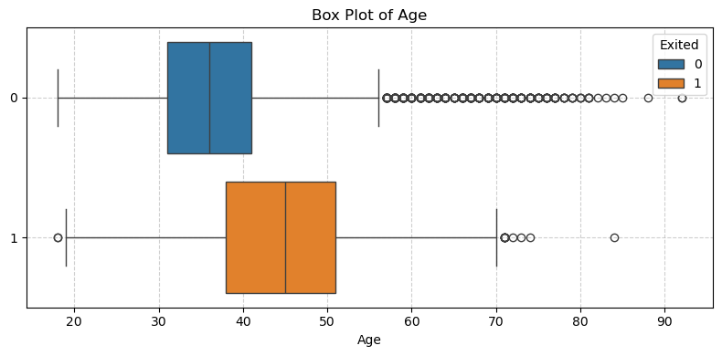

**Observación**:

- Los clientes que abandonan tienden a ser más mayores.

#### Distribución de Balance

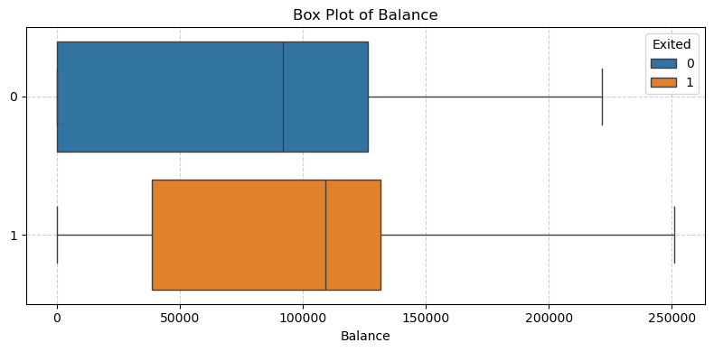

**Observación**:

- Los clientes que abandonan generalmente tienen balances de cuenta más altos.

#### Número de Productos

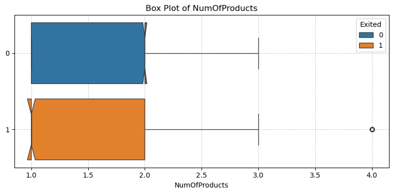

**Observación**:

- Los clientes con un producto tienen más probabilidades de abandonar que aquellos con múltiples productos.

#### Tenencia

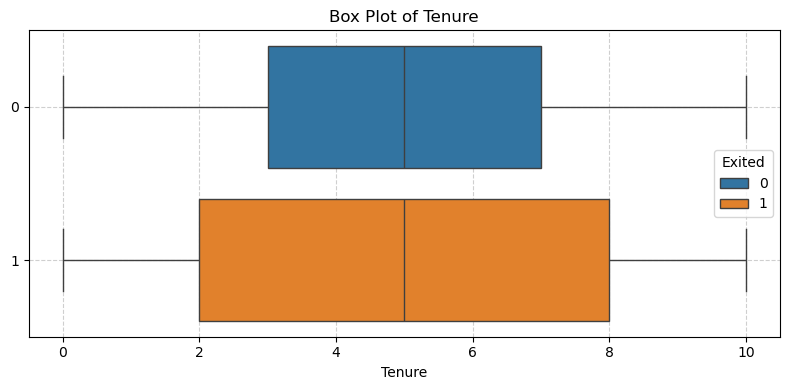

**Observación**:

- La distribución de tenencia es similar tanto para clientes que abandonan como para los que no, con ambos grupos teniendo una tenencia media de 5 años.
- Los clientes que abandonan muestran más variabilidad en su tenencia, lo que indica que pueden dejar el banco en diferentes etapas de su relación.

#### Salario Estimado

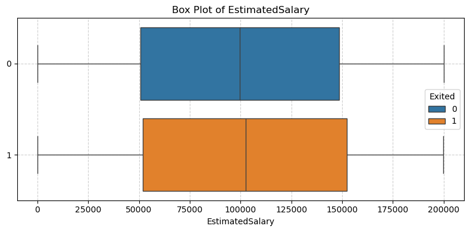

**Observación**:

- Los clientes que abandonan y los que no tienen balances similares, alrededor de 100,000.
- Ambos grupos muestran una distribución similar en los balances sin valores atípicos.

#### Puntuación de Satisfacción

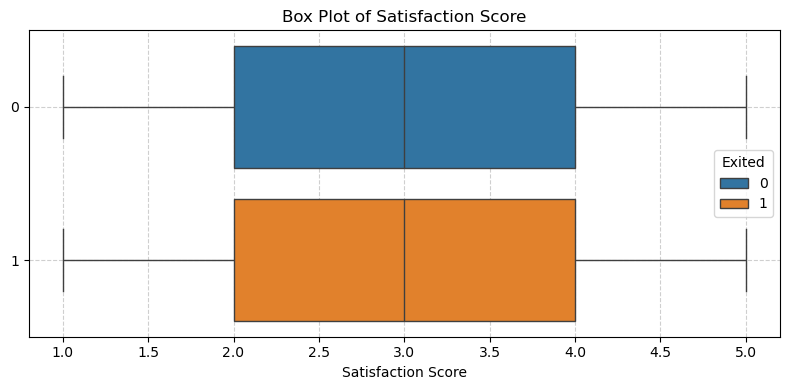

**Observación**:

- Los clientes que abandonan y los que no tienen la misma distribución, con una mediana de 3 y rangos intercuartiles idénticos.
- Las cercas superior e inferior también son idénticas, sin valores atípicos para ninguno de los grupos.

#### Geografía

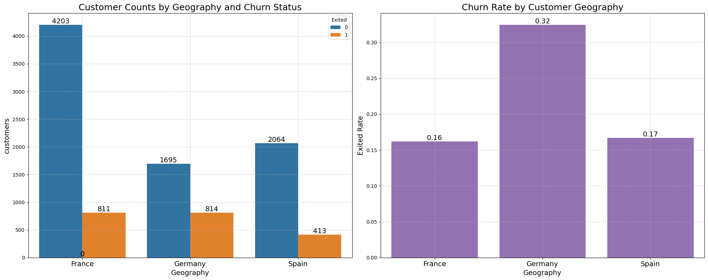

**Observación**:

- **Francia**: Tiene la mayor base de clientes, con una tasa de abandono del 16.2%.
- **Alemania**: Muestra una tasa de abandono significativamente más alta, con 32.4%, lo que sugiere que los clientes alemanes tienen más probabilidades de abandonar.
- **España**: Tiene una tasa de abandono similar a la de Francia, con un 16.7%.

Estas diferencias indican que la geografía podría influir en el abandono, con los clientes alemanes mostrando una mayor probabilidad de abandonar en comparación con los de Francia y España.

#### Puntuación de Satisfacción

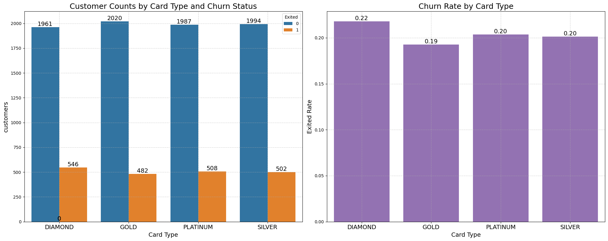

**Observación**:

- **Titulares de tarjeta Diamond**: Tienen la tasa de abandono más alta con 21.8%.
- **Titulares de tarjeta Gold**: Muestran la tasa de abandono más baja con 19.3%.
- **Titulares de tarjeta Platinum y Silver**: Tienen tasas de abandono similares, alrededor del 20.3% y 20.1%, respectivamente.

Estos resultados sugieren que los **titulares de tarjeta Diamond** tienen más probabilidades de abandonar, mientras que los **titulares de tarjeta Gold** tienen algo más de probabilidad de quedarse. Sin embargo, las diferencias en las tasas de abandono entre tipos de tarjeta son relativamente pequeñas.

### Extracción de Características

#### Eliminación de Características Potencialmente Problemáticas

Considero eliminar la característica `Complain` debido a su correlación casi perfecta con `Exited`, lo que podría causar filtración de datos:

```python
data.drop(columns=['CustomerId','Complain'], inplace=True)
```

---

## Preprocesamiento de Datos

### División de Datos en Entrenamiento y Prueba

Dividimos los datos en conjuntos de entrenamiento, validación y prueba. Esto se hace antes de la escala de las características para evitar la filtración de datos.

```python
from sklearn.model_selection import train_test_split

X = dataset.drop(columns='Exited')
y = dataset['Exited']

# División inicial para separar el conjunto de prueba
X_train_val, X_test, y_train_val, y_test = train_test_split(
    X, y, test_size=0.2, random_state=42, stratify=y)

# Dividir los datos restantes en conjuntos de entrenamiento y validación
X_train, X_val, y_train, y_val = train_test_split(
    X_train_val, y_train_val, test_size=0.25, random_state=42, stratify=y_train_val)
```

Con base en estas divisiones, la distribución final es:

| Conjunto         | Total de Registros | Porcentaje del Total de Datos |
|------------------|--------------------|------------------------------|
|  Entrenamiento   | 6,000              | 60%                          |
|  Validación      | 2,000              | 20%                          |
|  Prueba          | 2,000              | 20%                          |


### Transformador de Columnas

```python
from sklearn.compose import ColumnTransformer
from sklearn.preprocessing import OneHotEncoder, StandardScaler

num_cols = ['CreditScore', 'Age', 'Tenure', 'Balance', 'NumOfProducts', 'EstimatedSalary', 'Satisfaction Score', 'Point Earned']
cat_cols = ['Geography', 'Card Type', 'Gender']
bin_cols = ['HasCrCard', 'IsActiveMember']

preprocessor = ColumnTransformer(
    transformers=[
        # Codificación One-hot para variables categóricas
        ('one_hot_encoder', OneHotEncoder(drop='first', sparse_output=False), cat_cols),
        # Escalado estándar para características numéricas
        ('standard_scaler', StandardScaler(), num_cols),
    ],
    # Deja pasar las características binarias
    remainder='passthrough'
)

preprocessor.fit(X_train)

X_train = preprocessor.transform(X_train)
X_val = preprocessor.transform(X_val)
X_test = preprocessor.transform(X_test)

feature_names = list(preprocessor.named_transformers_['one_hot_encoder'] \
                            .get_feature_names_out(input_features=cat_cols))
feature_names = feature_names + num_cols + bin_cols
```

---

## Definición de la Función de Costo

Definimos una función de costo personalizada para evaluar nuestros modelos según la matriz de costos del negocio:

```python
from sklearn.metrics import confusion_matrix, make_scorer

def cost_function(y_true, y_pred, neg_label=0, pos_label=1):
    cm = confusion_matrix(y_true, y_pred, labels=[neg_label, pos_label])
    
    cost_matrix = np.array([
        [0, -200],  # [Costo de TN, Costo de FP]
        [-750, 550] # [Costo de FN, Ganancia de TP]
    ])
        
    total_gain = np.sum(cm * cost_matrix)
    return total_gain

cost_scorer = make_scorer(cost_function, greater_is_better=True, neg_label=0, pos_label=1)
```

Esta función calcula la ganancia (o pérdida) total para un conjunto de predicciones, considerando los costos asociados con cada tipo de resultado de la predicción.

---

## Entrenamiento de Modelos

Entrenaré tres modelos diferentes:

1. **Regresión Logística**
2. **Clasificador Random Forest**
3. **Clasificador XGBoost**

### Validación Cruzada

Se utiliza validación cruzada con k-fold estratificado para garantizar que cada partición tenga una distribución de clases similar:

```python
from sklearn.model_selection import cross_val_score, StratifiedKFold

skf = StratifiedKFold(n_splits=5, shuffle=True, random_state=42)
```

### Modelos Base

Comenzamos entrenando modelos base sin manejar el desequilibrio de clases.

#### Regresión Logística

```python
from sklearn.linear_model import LogisticRegression

lr_base = LogisticRegression(random_state=42)
lr_base.fit(X_train, y_train)
```

#### Random Forest

```python
from sklearn.ensemble import RandomForestClassifier

rf_base = RandomForestClassifier(random_state=42)
rf_base.fit(X_train, y_train)
```

#### XGBoost

```python
from xgboost import XGBClassifier

# La fracción de instancias positivas en el conjunto y_train_val
pos_frac = y_train_val.mean()

xgb_base = XGBClassifier(random_state=42, base_score=pos_frac)
xgb_base.fit(X_train, y_train)
```

### Modelos con Pesos

Se aplicaron pesos de clase para abordar el desequilibrio de clases.

#### Regresión Logística con Pesos de Clase

```python
lr_balanced = LogisticRegression(random_state=42, class_weight='balanced')
lr_balanced.fit(X_train, y_train)
```

#### Random Forest con Pesos de Clase

```python
rf_balanced = RandomForestClassifier(random_state=42, class_weight='balanced')
rf_balanced.fit(X_train, y_train)
```

#### XGBoost con Scale Pos Weight

Calculamos `scale_pos_weight` como la relación entre las clases negativas y positivas.

```python
from collections import Counter

counter = Counter(y_train)
neg_class = counter[0]
pos_class = counter[1]
scale_pos_weight = neg_class / pos_class

xgb_balanced = XGBClassifier(random_state=42, scale_pos_weight=scale_pos_weight, base_score=pos_frac)
xgb_balanced.fit(X_train, y_train)
```

---

## Evaluación de Modelos en Datos de Validación

### Métricas de Evaluación

Evaluamos los modelos usando varias métricas:

- **Precisión**: Exactitud general.
- **Precisión**: Predicciones positivas correctas sobre el total de predicciones positivas.
- **Recuperación**: Predicciones positivas correctas sobre los positivos reales.
- **Puntuación F1**: Promedio armónico de precisión y recuperación.
- **ROC-AUC**: Área bajo la curva ROC.
- **MCC**: Proporciona una evaluación balanceada considerando todos los elementos de la matriz de confusión.
- **Brier Score**: Evalúa la precisión de las predicciones probabilísticas midiendo la diferencia cuadrada media entre las probabilidades predichas y los resultados reales.

| Nombre del Modelo        | Exactitud | Precisión | Recall | F1 Score | ROC AUC | MCC    |
|----------------|----------|-------------|-----------|-----------|----------|----------|
| LR Base        | 0.8040   | 0.5564      | 0.1818    | 0.2741    | 0.7719   | 0.2339   |
| LR Balanced    | 0.7045   | 0.3808      | 0.7224    | 0.4987    | 0.7743   | 0.3492   |
| RF Base        | 0.8610   | 0.7452      | 0.4816    | 0.5851    | 0.8418   | 0.5236   |
| RF Balanced    | 0.8575   | 0.7480      | 0.4521    | 0.5636    | 0.8500   | 0.5065   |
| XGB Base       | 0.8535   | 0.6696      | 0.5528    | 0.6057    | 0.8362   | 0.5203   |
| XGB Balanced   | 0.8270   | 0.5695      | 0.6143    | 0.5910    | 0.8364   | 0.4821   |

**Observación**:

- RF destaca con el MCC y ROC AUC más altos, lo que indica un rendimiento robusto a través de múltiples métricas.
- Aunque RF Balanced tiene el ROC AUC más alto, RF Base alcanza el MCC más alto.
- En términos de puntuación F1, XGB obtiene los mejores resultados.

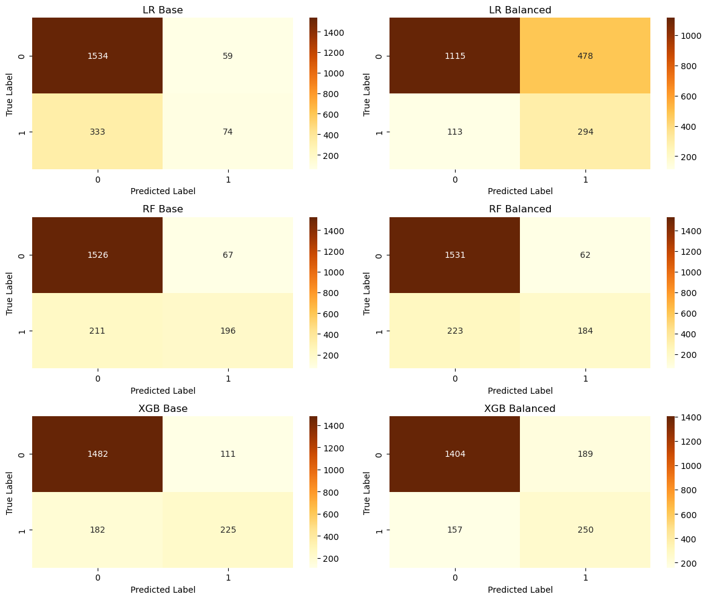

### Puntuaciones ROC AUC Validación Cruzada

| Modelo          | ROC AUC  |
|-----------------|----------|
| RF Balanced     | 0.8273   |
| RF Base         | 0.8256   |
| XGB Base        | 0.8143   |
| XGB Balanced    | 0.8075   |
| LR Balanced     | 0.7659   |
| LR Base         | 0.7641   |

### Calibración e Importancia de Características

#### Gráfico de Calibración

Los gráficos de calibración ayudan a evaluar qué tan bien las probabilidades predichas reflejan las probabilidades reales.

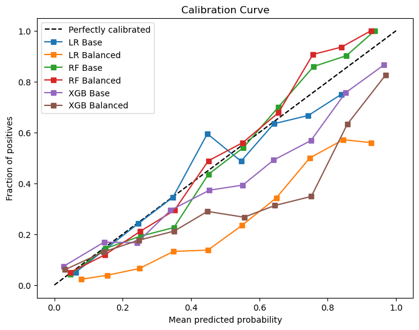

### Puntuaciones Brier (menor es mejor)

| Modelo          | Puntuación Brier |
|-----------------|------------------|
| RF Balanced     | 0.1068           |
| RF Base         | 0.1082           |
| XGB Base        | 0.1111           |
| XGB Balanced    | 0.1263           |
| LR Base         | 0.1350           |
| LR Balanced     | 0.1966           |

**Observación**:

- El **Balanced Random Forest** tiene el mejor puntaje Brier, lo que lo convierte en el modelo más preciso para las predicciones de probabilidad.
- El balanceo mejora ligeramente el **Random Forest**, pero empeora el rendimiento de la **Regresión Logística** y un poco el de **XGBoost**.

#### Importancia de las Características

Para determinar las características más importantes, utilizo **SHAP** (SHapley Additive exPlanations), que ayuda a entender cuánto contribuye cada característica a las predicciones del modelo.

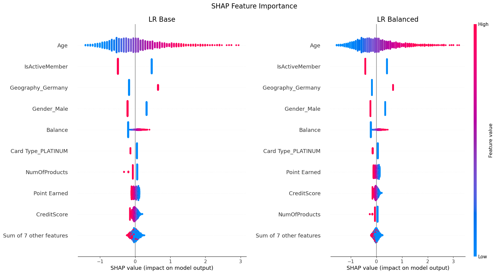

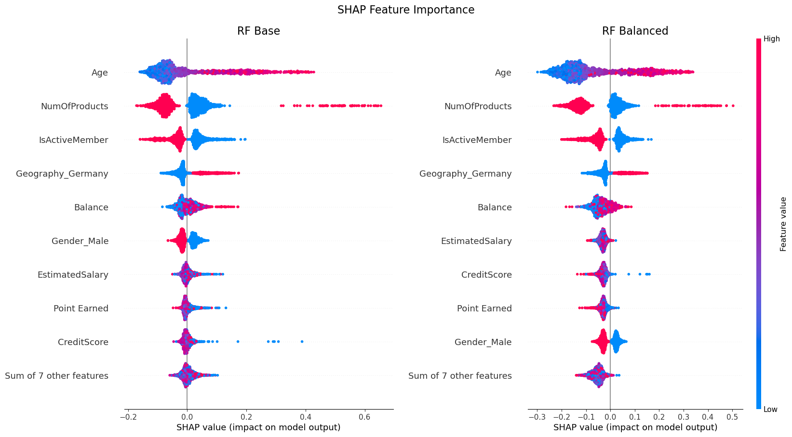

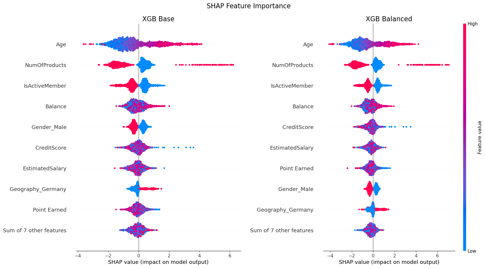

**Observación**:

- **Edad**, **Número de Productos** y **¿Es Miembro Activo?** son consistentemente las características más importantes en los modelos de RF y XGB, lo que indica que la edad, el número de productos y el estado de membresía activa influyen significativamente en la rotación.
- El balanceo del conjunto de datos tiene poco efecto en la importancia de las características para cada modelo.

---

## Ajuste del Umbral de Decisión

Por defecto, los modelos clasifican las muestras como positivas si la probabilidad predicha es ≥ 0.5. Sin embargo, este umbral podría no ser óptimo para nuestro escenario sensible a costos.

### Proceso de Ajuste del Umbral

Buscar un umbral que maximice nuestra función de costo personalizada con **TunedThresholdClassifierCV** de scikit-learn.

```python
from sklearn.model_selection import TunedThresholdClassifierCV

tuned_model = TunedThresholdClassifierCV(
    model,
    scoring=cost_scorer, # Puntaje personalizado para el negocio
    store_cv_results=True,
)

tuned_model.fit(X_train, y_train)
```

### Resultados Después del Ajuste del Umbral

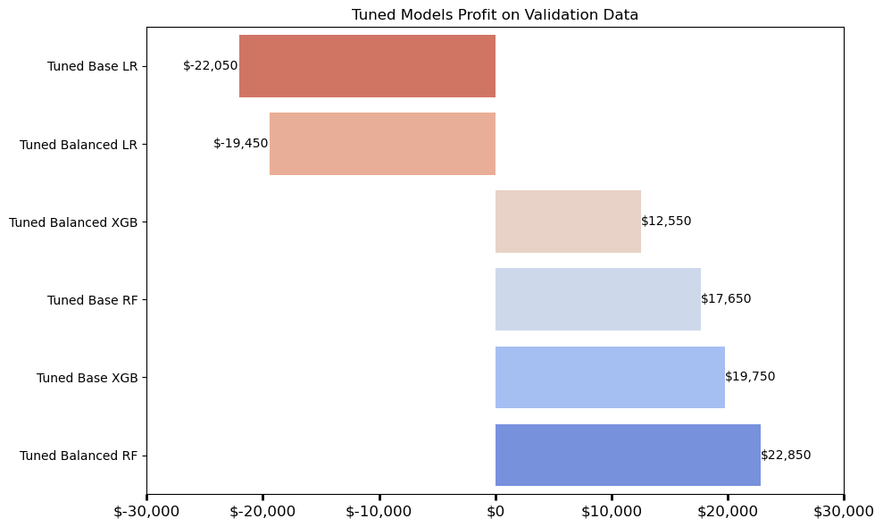


**Observación**:
- El modelo **Balanced RF post-ajuste** genera la mayor ganancia con $22,850, convirtiéndolo en el modelo de mejor rendimiento.
- Ambos modelos de **Regresión Logística ajustados** resultan en pérdidas negativas.

---

## Evaluación Final con Datos de Prueba

Se prueban los modelos en un conjunto de datos de prueba para evaluar su rendimiento final. Debido a su bajo rendimiento, la **Regresión Logística** fue excluida de estas evaluaciones.

### Rentabilidad del Modelo

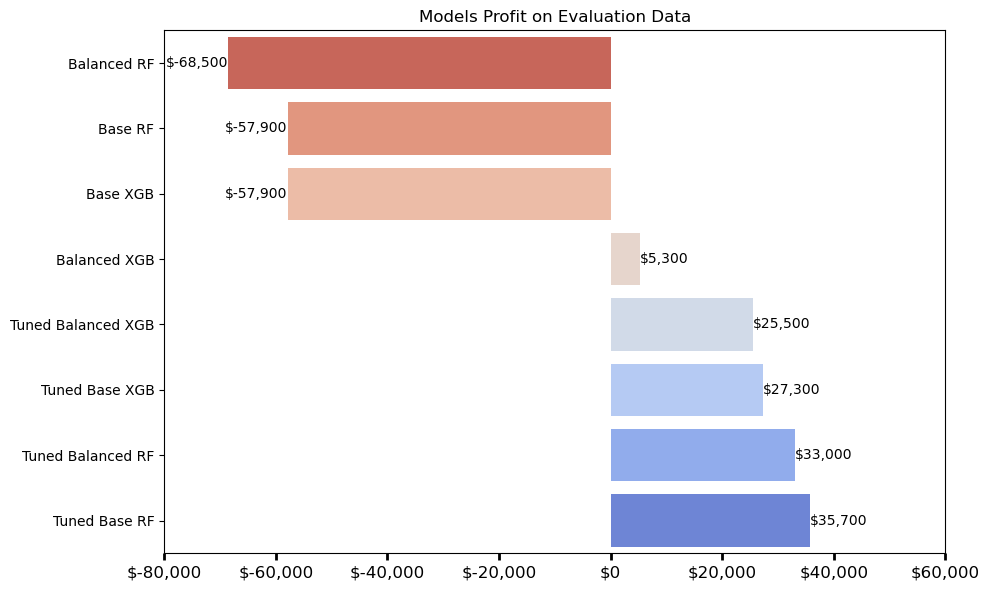

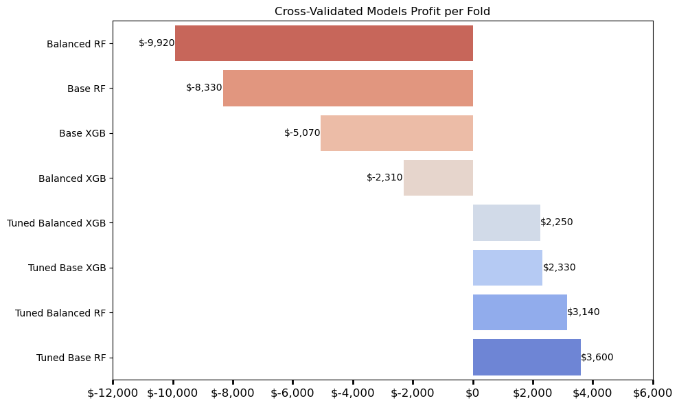

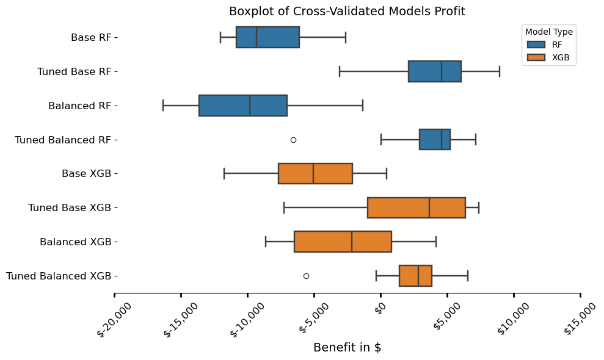

**Observación**:

- Con excepción de **Balanced XGB**, los modelos ajustados por umbral superan a todos los modelos no ajustados en términos de ganancia sobre datos no vistos.
- El modelo más rentable es el **Random Forest base ajustado por umbral**.

### Desempeño General del Modelo

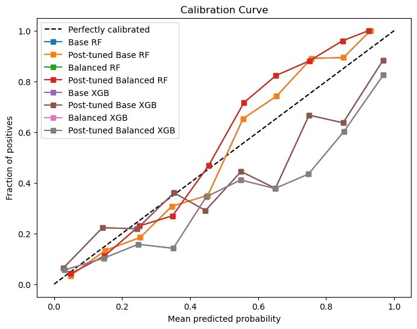

| Nombre del Modelo        | Exactitud | Precisión | Recall | F1 Score | ROC AUC | MCC    |
|--------------------------|-----------|-----------|--------|----------|---------|--------|
| Base RF                  | 0.8690    | 0.7897    | 0.4877 | 0.6030   | 0.8578  | 0.5518 |
| Base RF post-ajuste      | 0.7125    | 0.4016    | 0.8358 | 0.5426   | 0.8578  | 0.4212 |
| Balanced RF              | 0.8700    | 0.8217    | 0.4632 | 0.5925   | 0.8632  | 0.5526 |
| Balanced RF post-ajuste  | 0.6480    | 0.3549    | 0.8873 | 0.5070   | 0.8632  | 0.3820 |
| Base XGB                 | 0.8470    | 0.6635    | 0.5074 | 0.5750   | 0.8403  | 0.4902 |
| Base XGB post-ajuste     | 0.6585    | 0.3598    | 0.8652 | 0.5083   | 0.8403  | 0.3794 |
| Balanced XGB             | 0.8400    | 0.5987    | 0.6544 | 0.6253   | 0.8439  | 0.5247 |
| Balanced XGB post-ajuste | 0.6980    | 0.3874    | 0.8260 | 0.5274   | 0.8439  | 0.3992 |

## Mejor Modelo

### Random Forest post-ajuste

| Nombre del Modelo       | Exactitud | Precisión | Recall | F1 Score | ROC AUC | MCC    |
|-------------------------|-----------|-----------|--------|----------|---------|--------|
| Base RF post-ajuste      | 0.7125    | 0.4016    | 0.8358 | 0.5426   | 0.8578  | 0.4212 |

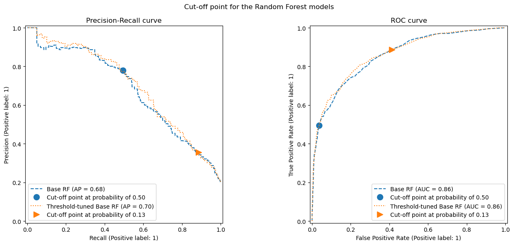

---

## Conclusión

Predecir la rotación de clientes no se trata solo de identificar quién tiene más probabilidades de irse, sino también de entender el impacto financiero de perder a un cliente. Al adoptar un enfoque sensible a los costos, este proyecto buscó alinear la modelización predictiva con los objetivos empresariales, asegurando que las estrategias de retención maximicen las ganancias financieras.

El análisis demostró que manejar el desbalance de clases es crucial para una predicción efectiva de la rotación. Mientras que los modelos tradicionales tienden a favorecer la clase mayoritaria, la aplicación de técnicas como el **pesado de clases** mejoró el recall, permitiendo que el modelo capturara mejor a los clientes en riesgo de rotación.

Entre los modelos probados, el **Random Forest post-ajuste balanceado** surgió como la opción más rentable. Al ajustar los umbrales de decisión, este modelo optimizó el balance entre identificar correctamente a los clientes que se irán y minimizar los falsos positivos, lo que llevó a las mayores ganancias financieras sobre datos no vistos.

Además, el análisis de la importancia de las características reveló que **Edad, Número de Productos y Membresía Activa** fueron los factores clave para predecir la rotación. Comprender estos factores permite a las empresas desarrollar intervenciones dirigidas para retener a los clientes de manera efectiva.

### Principales Conclusiones

1. **El Enfoque Sensible a los Costos Mejora la Alineación con el Negocio**\
   Incorporar una matriz de costos en la evaluación del modelo aseguró que las predicciones estuvieran alineadas con los resultados financieros en lugar de la precisión estadística pura. Este enfoque ayudó a equilibrar la maximización de ganancias con la mitigación de costos innecesarios.

2. **El Desbalance de Clases Afecta el Rendimiento del Modelo**\
   El conjunto de datos exhibió un desbalance significativo de clases, que fue abordado usando **pesado de clases** y aprendizaje sensible a costos. Los modelos balanceados obtuvieron mejores resultados en términos de recall, asegurando que se identificara correctamente más casos de rotación.

3. **El Modelo Random Forest Post-Ajuste Fue el Mejor**\
   Después del ajuste de umbral, el **Random Forest balanceado post-ajuste** emergió como el modelo más rentable, alcanzando la mayor ganancia financiera sobre datos no vistos.

4. **La Importancia de las Características Resalta los Patrones de Comportamiento del Cliente**\
   Características como **Edad, Número de Productos y Membresía Activa** tuvieron el mayor impacto en las predicciones de rotación, lo que resalta la necesidad de estrategias de retención dirigidas a grupos específicos de clientes.

### Próximos Pasos

- **Integración del Valor de Vida del Cliente (CLV)**\
  Modelos futuros podrían incorporar el **Valor de Vida del Cliente (CLV)** en la función de costos para priorizar a los clientes de alto valor y optimizar la asignación de recursos.

- **Modelo de Costo Dinámico**\
  La matriz de costos fija asume costos y ganancias uniformes entre todos los clientes, lo cual puede no reflejar las variaciones del mundo real. Un enfoque dinámico y basado en datos para la estimación de costos podría mejorar la toma de decisiones financieras.

- **Consideración de la Experiencia del Cliente**\
  Si bien la maximización de ganancias fue el objetivo principal, las empresas deben equilibrar las acciones predictivas con la experiencia del cliente para evitar que las estrategias de retención tengan efectos negativos.

- **Preparación Operativa para el Despliegue**\
  Antes de desplegar el modelo, es crucial evaluar las limitaciones del mundo real, como **latencia, escalabilidad e integración** con los sistemas de gestión de clientes existentes.

---

## Referencias

- [Documentación de Scikit-learn](https://scikit-learn.org/stable/)
- [Aprendizaje de datos desbalanceados - EuroSciPy 2023](https://youtu.be/6YnhoCfArQo?si=U059Ix4S2BOLWeH7)
- [¿Qué está ocultando tu modelo? Un tutorial sobre evaluación de modelos ML](https://www.evidentlyai.com/blog/tutorial-2-model-evaluation-hr-attrition)

---

**¡Gracias por leer!** Si tienes alguna pregunta o comentario, no dudes en contactarme. Aprecio mucho tu retroalimentación.

---

**Keywords**: Machine Learning, Cost-Sensitive Learning, Classification, Data Science, Business Analytics


---
