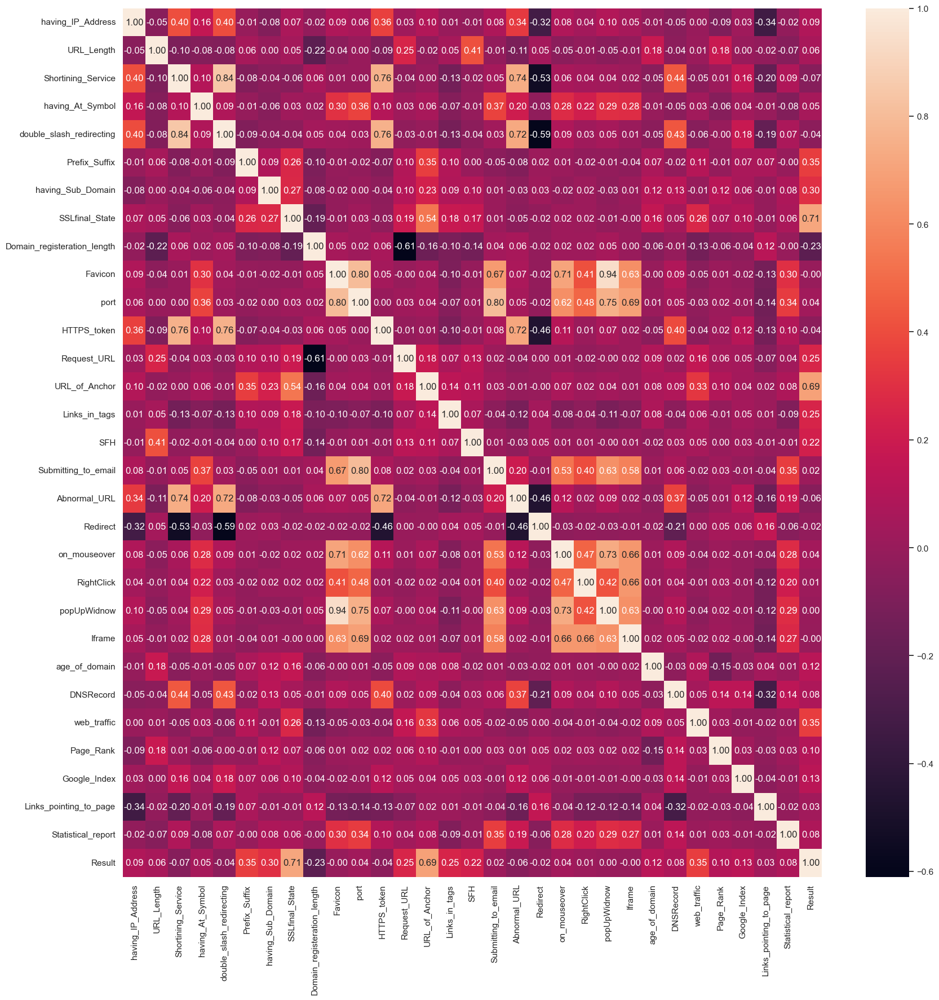

# **Introducción**  
Los ataques de phishing son una de las amenazas más comunes en ciberseguridad hoy en día, engañando a los usuarios para que proporcionen información sensible a través de sitios web maliciosos. Con las técnicas de phishing evolucionando, los sistemas de detección automatizados son cruciales para mantenerse a la vanguardia. Es por eso que construí un **clasificador de URLs de phishing**, una aplicación web impulsada por aprendizaje automático que predice si una URL dada es legítima o fraudulenta.

En este blog, recorreré cómo desarrollé este proyecto, desde la **extracción de características** hasta el **entrenamiento del modelo** y la **construcción de la aplicación web** utilizando Flask.

---

# **Cómo Funciona la Aplicación**  
La aplicación permite a los usuarios ingresar una URL. Luego, el sistema realiza los siguientes pasos:

1. **Extracción de Características**: La aplicación analiza diversas características de la URL, como la longitud, la presencia de caracteres especiales, la antigüedad del dominio y el uso de HTTPS.
2. **Predicción del Modelo**: Un **clasificador Random Forest** predice si la URL es **phishing (-1) o legítima (1)** en base a estas características.
3. **Mostrar Resultados**: La aplicación devuelve el resultado de la clasificación junto con la puntuación de probabilidad.

Este proceso automatizado permite una detección rápida de phishing sin necesidad de intervención manual.

---

# **Extracción de Características: ¿Qué Hace Sospechosa a una URL?**  

Una parte clave de la detección de phishing es la **ingeniería de características**, que significa definir características medibles de las URLs que ayudan a determinar si pueden ser fraudulentas. Los atacantes a menudo utilizan técnicas engañosas para engañar a los usuarios, y al analizar diferentes aspectos de una URL, podemos detectar patrones sospechosos. Aquí están las características que considera nuestra aplicación:  

### **Características Básicas de la URL**  
- **Longitud de la URL**: Las URLs más largas tienden a ocultar contenido malicioso.  
  - **Legítima** (< 54 caracteres)  
  - **Sospechosa** (54-75 caracteres)  
  - **Phishing** (> 75 caracteres)  
- **Presencia del Símbolo "@"**: Si una URL contiene un **@**, a menudo es un intento de phishing para engañar a los usuarios.  
- **Redirecciones ("//" en Uso)**: Si una URL contiene múltiples "//" fuera de su posición normal, puede estar tratando de disfrazar su destino real.  
- **Uso de Guiones en el Dominio**: Un dominio con guiones (por ejemplo, "secure-bank-login.com") a menudo es una señal de phishing.  
- **Cantidad de Subdominios**:  
  - **Legítima** (0-1 subdominios)  
  - **Sospechosa** (2 subdominios)  
  - **Phishing** (3+ subdominios)  
- **URLs Acortadas**: Los atacantes a menudo utilizan servicios como bit.ly o tinyurl.com para enmascarar los enlaces de phishing.  

### **Indicadores de Dominio y Seguridad**  
- **Uso de HTTPS y Validez del Certificado SSL**: La falta de HTTPS o un certificado SSL inválido aumenta el riesgo de phishing.  
- **Antigüedad del Dominio**: Los dominios nuevos (menos de 6 meses) suelen ser creados para phishing antes de ser marcados.  
- **Expiración del Dominio**: Si un dominio expira en **≤ 1 año**, es una señal de advertencia, ya que las empresas legítimas generalmente registran dominios por períodos más largos.  
- **Disponibilidad del Registro WHOIS**: Si faltan los datos de WHOIS, podría indicar un sitio fraudulento.  

### **Estructura del Sitio Web y Contenido**  
- **Fuente del Favicon**: Si el favicon del sitio web (ícono en la pestaña del navegador) se carga desde un dominio externo, podría ser un phishing.  
- **Puertos No Estándar**: Los sitios de phishing pueden usar puertos no comunes en lugar de los estándar como 80 (HTTP) o 443 (HTTPS).  
- **"HTTPS" en el Nombre del Dominio**: Si el dominio mismo contiene "https" (por ejemplo, "https-secure-login.com"), probablemente sea engañoso.  
- **Solicitudes Externas y Enlaces**:  
  - Un **porcentaje alto** de solicitudes externas (imágenes, scripts) puede indicar un intento de phishing.  
  - Demasiados **enlaces ancla** externos (enlaces clicables) también sugieren que la página está redirigiendo a los usuarios a otro lugar.  
  - Si los enlaces externos están dentro de etiquetas `<meta>`, `<script>` o `<link>`, es otra señal sospechosa.  

### **Interacción del Usuario y Comportamiento**  
- **Manejador de Formularios del Servidor (SFH)**: Si los datos del formulario se envían a un dominio diferente o a un manejador vacío, el sitio puede estar robando credenciales.  
- **Envío de Información a Correo Electrónico**: Si la página envía datos a través de `mailto:` o utiliza la función `mail()` de PHP, podría ser phishing.  
- **Formato Abnormal de la URL**: El dominio de un sitio legítimo debe coincidir con el nombre del host real. Si no lo hace, algo está mal.  
- **Redirección del Sitio Web**:  
  - **Legítima**: 0-1 redirecciones  
  - **Sospechosa**: 2-3 redirecciones  
  - **Phishing**: 4+ redirecciones  
- **Manipulación de la Barra de Estado**: Si el sitio modifica la barra de estado (por ejemplo, usando trucos con JavaScript `onMouseOver`), probablemente sea phishing.  
- **Deshabilitación del Clic Derecho**: Los sitios de phishing suelen deshabilitar el clic derecho para evitar que los usuarios inspeccionen los elementos o copien el texto.  
- **Ventanas Emergentes con Campos de Entrada**: Si una ventana emergente contiene campos de formulario, podría estar intentando capturar credenciales de inicio de sesión.  
- **Uso de Iframes**: Los **sitios de phishing** a menudo usan etiquetas `<iframe>` para incrustar contenido malicioso de otra fuente.  

### **Reputación y Popularidad**  
- **Tráfico del Sitio Web**: Los sitios clasificados **por debajo de 100,000** (según Tranco) suelen ser legítimos, mientras que los sitios de bajo tráfico son más sospechosos.  
- **Puntuación PageRank**: Si el sitio tiene un **bajo PageRank (< 0.2)**, es un posible riesgo de phishing.  
- **Indexación en Google**: Si un sitio no está indexado por Google, podría ser inseguro.  
- **Backlinks (Enlaces Externos que Apuntan al Sitio)**:  
  - **Legítimo**: Más de 2 backlinks  
  - **Sospechoso**: 1-2 backlinks  
  - **Phishing**: 0 backlinks  
- **Análisis Basado en Informes Estadísticos**: Si el dominio aparece en bases de datos de phishing (como PhishTank), casi con certeza es malicioso.  

Al extraer todas estas características, la aplicación construye un conjunto de datos que ayuda a identificar intentos de phishing con mayor precisión. Estas señales trabajan juntas para detectar patrones comúnmente encontrados en sitios fraudulentos, mejorando nuestra capacidad para marcar URLs sospechosas antes de que causen daño.  

---

# **Entrenando el Modelo de Aprendizaje Automático**  

Detectar sitios web de phishing requiere un modelo de clasificación sólido capaz de identificar patrones engañosos en las URLs. Elegí un **clasificador Random Forest**, un algoritmo de aprendizaje en conjunto poderoso que maneja eficazmente estructuras de datos complejas, a la vez que ofrece interpretabilidad. A continuación, se detalla el proceso que seguí:  

---

## **1. Análisis Exploratorio de Datos (EDA)**  

Antes de sumergirme en el entrenamiento del modelo, realicé un **Análisis Exploratorio de Datos (EDA)** para comprender mejor el conjunto de datos y sus características.  

### **Resumen del Conjunto de Datos**  
El conjunto de datos se descargó de [`UCI Machine Learning Repository`](https://archive.ics.uci.edu/dataset/327/phishing+websites), donado por R. Mohammad y L. McCluskey en 2015. No se especifica cómo recopilaron los datos, pero las características están bien documentadas. El conjunto de datos contiene **11,055 URLs**, de las cuales **6,157 están etiquetadas como phishing (1) y 4,898 como legítimas (-1)**. Este pequeño desequilibrio de clases significa que los sitios de phishing son ligeramente más prevalentes, pero aún lo suficientemente cerca como para no requerir técnicas drásticas de remuestreo.  

Para obtener una imagen más clara, analicé las **características y correlaciones** del conjunto de datos para identificar los indicadores más fuertes del comportamiento de phishing.  
 

<div style="overflow-x: auto;">
<table border="1" class="dataframe"><thead><tr style="text-align: right;"><th></th><th>having_IP_Address</th><th>URL_Length</th><th>Shortining_Service</th><th>having_At_Symbol</th><th>double_slash_redirecting</th><th>Prefix_Suffix</th><th>having_Sub_Domain</th><th>SSLfinal_State</th><th>Domain_registeration_length</th><th>Favicon</th><th>port</th><th>HTTPS_token</th><th>Request_URL</th><th>URL_of_Anchor</th><th>Links_in_tags</th><th>SFH</th><th>Submitting_to_email</th><th>Abnormal_URL</th><th>Redirect</th><th>on_mouseover</th><th>RightClick</th><th>popUpWidnow</th><th>Iframe</th><th>age_of_domain</th><th>DNSRecord</th><th>web_traffic</th><th>Page_Rank</th><th>Google_Index</th><th>Links_pointing_to_page</th><th>Statistical_report</th><th>Result</th></tr></thead><tbody><tr><th>0</th><td>-1</td><td>1</td><td>1</td><td>1</td><td>-1</td><td>-1</td><td>-1</td><td>-1</td><td>-1</td><td>1</td><td>1</td><td>-1</td><td>1</td><td>-1</td><td>1</td><td>-1</td><td>-1</td><td>-1</td><td>0</td><td>1</td><td>1</td><td>1</td><td>1</td><td>-1</td><td>-1</td><td>-1</td><td>-1</td><td>1</td><td>1</td><td>-1</td><td>-1</td></tr><tr><th>1</th><td>1</td><td>1</td><td>1</td><td>1</td><td>1</td><td>-1</td><td>0</td><td>1</td><td>-1</td><td>1</td><td>1</td><td>-1</td><td>1</td><td>0</td><td>-1</td><td>-1</td><td>1</td><td>1</td><td>0</td><td>1</td><td>1</td><td>1</td><td>1</td><td>-1</td><td>-1</td><td>0</td><td>-1</td><td>1</td><td>1</td><td>1</td><td>-1</td></tr><tr><th>2</th><td>1</td><td>0</td><td>1</td><td>1</td><td>1</td><td>-1</td><td>-1</td><td>-1</td><td>-1</td><td>1</td><td>1</td><td>-1</td><td>1</td><td>0</td><td>-1</td><td>-1</td><td>-1</td><td>-1</td><td>0</td><td>1</td><td>1</td><td>1</td><td>1</td><td>1</td><td>-1</td><td>1</td><td>-1</td><td>1</td><td>0</td><td>-1</td><td>-1</td></tr><tr><th>3</th><td>1</td><td>0</td><td>1</td><td>1</td><td>1</td><td>-1</td><td>-1</td><td>-1</td><td>1</td><td>1</td><td>1</td><td>-1</td><td>-1</td><td>0</td><td>0</td><td>-1</td><td>1</td><td>1</td><td>0</td><td>1</td><td>1</td><td>1</td><td>1</td><td>-1</td><td>-1</td><td>1</td><td>-1</td><td>1</td><td>-1</td><td>1</td><td>-1</td></tr><tr><th>4</th><td>1</td><td>0</td><td>-1</td><td>1</td><td>1</td><td>-1</td><td>1</td><td>1</td><td>-1</td><td>1</td><td>1</td><td>1</td><td>1</td><td>0</td><td>0</td><td>-1</td><td>1</td><td>1</td><td>0</td><td>-1</td><td>1</td><td>-1</td><td>1</td><td>-1</td><td>-1</td><td>0</td><td>-1</td><td>1</td><td>1</td><td>1</td><td>1</td></tr></tbody></table></div>

### **Correlaciones de Características**  



El **análisis de mapa de calor** muestra la correlación entre cada característica y la variable objetivo (phishing o legítima). Las observaciones clave incluyen:

*   **Validez del Certificado SSL:** Una fuerte correlación positiva (0.71) indica que los sitios web con un certificado SSL válido son mucho más propensos a ser legítimos. Los sitios de phishing a menudo carecen de certificados adecuados.
*   **Etiquetas de Ancla Enlazando a Dominios Externos:** Una alta correlación positiva (0.69) sugiere que los sitios de phishing tienden a tener un alto porcentaje de enlaces de ancla salientes que redirigen a los usuarios a diferentes dominios.
*   **Presencia de Subdominios:** Una correlación positiva moderada (0.30) indica que la presencia de múltiples subdominios puede ser una señal de actividad de phishing.
*   **Prefijo/Sufijo en el Dominio:** Una correlación positiva moderada (0.35) sugiere que la presencia de guiones u otros prefijos/sufijos en el nombre de dominio puede ser indicativa de phishing.
*   **Solicitudes de URLs de Fuentes Externas:** Una correlación positiva (0.25) sugiere que una mayor proporción de recursos cargados externamente (imágenes, scripts) puede ser una señal de alerta.
*   **Duración del Registro del Dominio:** Una correlación negativa (-0.23) sugiere que los sitios de phishing tienen más probabilidades de tener períodos de registro de dominio más cortos.

Este mapa de calor visualiza eficazmente las relaciones entre las características y la probabilidad de que un sitio web sea de phishing, destacando los factores más influyentes.

---

### **Manejo de Datos Desbalanceados**  
Aunque el conjunto de datos no está severamente desbalanceado, los URLs de phishing superan ligeramente a los legítimos. Para asegurarme de que el modelo aprendiera de ambas clases de manera efectiva, apliqué **ponderación de clases** en lugar de sobremuestreo o submuestreo. Esto evita que el modelo se sesgue hacia la clase mayoritaria.

---

## **2. Selección y Entrenamiento del Modelo**  

Para encontrar el mejor modelo para la detección de phishing, probé varios algoritmos utilizando **LazyPredict**, una herramienta de referencia automatizada. Los modelos con mejor rendimiento incluyeron:  

| Modelo                     | Exactitud | Exactitud Balanceada | ROC AUC | Puntuación F1 |  
|----------------------------|-----------|----------------------|---------|---------------|  
| **Clasificador Extra Trees** | 97.6%     | 97.6%                | 97.6%   | 97.6%         |  
| **Random Forest**           | 97.4%     | 97.3%                | 97.3%   | 97.4%         |  
| **XGBoost**                 | 97.3%     | 97.2%                | 97.2%   | 97.3%         |  

🔹 **¿Por qué Random Forest?**  
Aunque Extra Trees tuvo un rendimiento ligeramente mejor, **Random Forest** proporcionó una exactitud comparable y es más fácil de interpretar. Además, maneja bien el sobreajuste al promediar múltiples árboles de decisión, asegurando un rendimiento robusto en nuevos datos.

### **Validación Cruzada**  
Para validar la estabilidad del modelo, realicé una **validación cruzada de 5 pliegues**, lo que confirmó una **exactitud promedio del 97.1%**. Esta consistencia en diferentes divisiones del conjunto de datos indicó que el modelo generaliza bien.  

---

## **3. Evaluación del Modelo**  

Una vez entrenado, evalué el **clasificador Random Forest** en el conjunto de prueba, que contenía **2,211 URLs**. Los resultados fueron impresionantes:

✔️ **Exactitud**: **98%** – El modelo clasificó correctamente el 98% de las URLs de phishing y legítimas.  
✔️ **Precisión**: **98%** – De todas las URLs clasificadas como phishing, el 98% eran realmente sitios de phishing.  
✔️ **Recall**: **98%** – El modelo detectó correctamente el 98% de las URLs de phishing.  
✔️ **Puntuación F1**: **98%** – Un buen equilibrio entre precisión y recall.  
✔️ **Puntuación ROC-AUC**: **98%** – Indica un buen rendimiento para distinguir entre sitios de phishing y legítimos.  

### **Análisis de la Matriz de Confusión**  
Una matriz de confusión ayuda a visualizar el rendimiento del modelo:  

|               | Predicción Legítima (-1) | Predicción Phishing (1) |  
|--------------|--------------------------|-------------------------|  
| **Legítima (-1)**   | **951** (Verdaderos Negativos) | **29** (Falsos Positivos) |  
| **Phishing (1)**    | **21** (Falsos Negativos) | **1210** (Verdaderos Positivos) |

🔹 **Falsos Positivos (29 casos)**: Estos son URLs legítimas incorrectamente marcadas como phishing. Un menor número de falsos positivos reduce la frustración innecesaria de los usuarios.  
🔹 **Falsos Negativos (21 casos)**: Estos son URLs de phishing incorrectamente clasificadas como legítimas. Minimizar los falsos negativos es crucial, ya que perder un intento de phishing puede generar brechas de seguridad.

### **Compromiso entre Precisión y Recall**  
- Una **alta precisión** significa que el modelo hace menos acusaciones erróneas (sitios legítimos mal clasificados como phishing).  
- Un **alto recall** significa que el modelo detecta más sitios de phishing, pero puede marcar algunos legítimos por error.  
- Con ambos al **98%**, el modelo logra un excelente equilibrio.

---

# **Creación de la Aplicación Web con Flask**  
Una vez entrenado el modelo, creé una **aplicación web Flask** para permitir que los usuarios interactúen con él. La aplicación consta de:

- **Frontend (HTML, CSS)**: Una interfaz simple donde los usuarios ingresan una URL.
- **Backend (API Flask)**:
  - El endpoint `/predict` recibe la URL ingresada.
  - La clase **FeatureExtractor** extrae las características relevantes.
  - El **modelo Random Forest** predice si la URL es phishing.
  - Los resultados se devuelven como una respuesta JSON.

Ruta de Flask para predicción:
```python
@app.route("/predict", methods=["POST"])
def predict():
    try:
        data = request.get_json()
        if not data or "url" not in data:
            return jsonify({"success": False, "message": "No URL provided."}), 400
        url = data["url"]
        
        # Preprocesar los datos de entrada
        extractor = FeatureExtractor(url)
        X_processed = extractor.extract_all_features()
        features = parse_features(X_processed)

        # Hacer la predicción
        prediction = model.predict(X_processed)
        probability = model.predict_proba(X_processed)  
        probability = np.max(probability)
        return jsonify({
            "success": True,
            "prediction": int(prediction[0]),
            "probability": probability,
            "features": features
        })

    except Exception as e:
        logging.error(f"Error: {e}")
        status_code = extract_status_code(str(e))
        if status_code: 
            return jsonify({"success": False, "message": status_code}), 500
        else:
            return jsonify({"success": False, "message": "Invalid URL"}), 500
```
Esta API permite la clasificación en tiempo real de URLs, haciendo que la detección de phishing esté al alcance de los usuarios.

**Directorios y Archivos Clave:**

- **`app/`**: Contiene los archivos de la aplicación Flask.
  - **`static/`**: Activos estáticos como CSS y JavaScript.
  - **`templates/`**: Plantillas HTML.
  - **`__init__.py`**: Inicializa la aplicación Flask y la caché.
  - **`routes.py`**: Define las rutas de Flask y la lógica de predicción.
- **`data/`**: Almacenamiento de datos.
  - **`raw/`**: Datos originales, no procesados.
  - **`processed/`**: Datos limpiados y procesados.
  - **`external/`**: Conjuntos de datos o recursos externos.
- **`notebooks/`**: Cuadernos de Jupyter para exploración y modelado.
- **`src/`**: Código fuente para pipelines de ML.
  - **`feature_pipeline.py`**: Ingeniería y selección de características.
  - **`model_pipeline.py`**: Entrenamiento y evaluación del modelo.
  - **`inference_pipeline.py`**: Inferencia de datos para predicción directa en consola.
  - **`config.py`**: Parámetros de configuración.
  - **`utils.py`**: Funciones auxiliares.
- **`models/`**: Modelos y pipelines serializados.
  - **`phishing_model.pkl`**: Modelo de machine learning entrenado.
- **`reports/`**: Documentación e informes.
- **`requirements.txt`**: Dependencias de Python.
- **`setup.py`**: Script de configuración del paquete.
- **`run_pipeline.py`**: Script para ejecutar pipelines de ML.
- **`run_app.py`**: Script para iniciar la aplicación Flask.
- **`Dockerfile`**: Configuración de Docker para contenedorización.
- **`.gitignore`**: Archivos y directorios que se deben ignorar en Git.
- **`README.md`**: Documentación del proyecto.

---

## **Interfaz de la Aplicación**

Así es como se ve la aplicación en acción:

### **1. Ingreso de una URL**  
La interfaz principal proporciona un campo de entrada simple donde los usuarios pueden ingresar una URL para verificar amenazas de phishing.  


### **2. Escaneo de la URL**  
Una vez que la URL es enviada, la aplicación procesa la solicitud y devuelve una predicción. A continuación, la URL "randolphrogers.me" ha sido clasificada como segura con una **probabilidad del 95.00%**.  


### **3. Vista de Depuración**  
Para obtener más detalles, una versión de depuración muestra un desglose de todas las características extraídas y sus puntuaciones individuales, brindando transparencia al proceso de clasificación.  


---

# **Resultados y Análisis**

Después de construir con éxito la aplicación y la canalización de extracción de características, probé el modelo en datos completamente nuevos, incluidos sitios confirmados como phishing. Sin embargo, los resultados fueron decepcionantes. El modelo, que había tenido un desempeño **casi perfecto durante la evaluación**, luchó por clasificar correctamente los sitios de phishing en escenarios del mundo real.

### **Identificación del Problema: ¿Sobreajuste o Limitaciones del Conjunto de Datos?**  
Al principio, sospeché de un **sobreajuste**. Revisé mis procedimientos de entrenamiento y prueba, pero todas las métricas de rendimiento sugerían un modelo bien entrenado. Para investigar más a fondo, creé un **nuevo conjunto de datos de retención**, simulando condiciones del mundo real, y evalué el modelo nuevamente. ¿Los resultados? **Excelente desempeño, al igual que en el entrenamiento.**

Esto planteó una pregunta crítica: **¿Por qué el modelo falló en sitios de phishing reales, pero funcionó bien con los datos de prueba?**

### **Depuración con Inspección de Características**  
Usando el **modo de depuración** de la aplicación, examiné manualmente los resultados de cada sitio de phishing incorrectamente clasificado, comparando sus valores de características con lo que el modelo había aprendido. Esto llevó a un descubrimiento clave:

> **Cada nuevo sitio de phishing seguía casi todas las características de detección de phishing más importantes de mi conjunto de datos.**

El verdadero problema se hizo evidente. **El conjunto de datos que utilicé para entrenar estaba obsoleto.**

### **La Carrera Armamentista en Ciberseguridad: Por Qué los Datos Recientes Importan**  
En ciberseguridad, existe una **carrera entre los atacantes (equipo rojo) y los defensores (equipo azul)**. Nuevas técnicas de phishing surgen a medida que las medidas de seguridad evolucionan, y los patrones de detección antiguos se vuelven **ineficaces**. Mi conjunto de datos estaba desactualizado, lo que significaba que el modelo había **aprendido a detectar las tendencias de phishing pasadas** en lugar de las amenazas más recientes.

### **Buscando Datos Actualizados: Un Nuevo Conjunto de Datos, Nuevos Desafíos**  
Después de darme cuenta de esto, busqué un conjunto de datos más **reciente**. El mejor que encontré fue **recolectado dos años después** que mi conjunto original. Sin embargo, tenía **solo 17 características en lugar de mis 30**. Volví a entrenar y probar el modelo usando este conjunto de datos, y aunque los resultados fueron **ligeramente más débiles**, todavía fueron comparables.

Esto confirmó que, si bien **la frescura de los datos es crítica**, **la riqueza de las características también juega un papel importante** en mantener un buen rendimiento del modelo.

### **Limitaciones de la Recopilación de Datos Modernos**  
Uno de los mayores desafíos en el aprendizaje automático relacionado con la ciberseguridad es **el acceso a datos actualizados**. Muchas fuentes que anteriormente proporcionaban información útil ya no están disponibles.

Por ejemplo:  
- **Alexa Internet**, que proporcionaba clasificaciones de tráfico web para millones de sitios web, fue **cerrada en 2022**  
- **Varias bases de datos clave de inteligencia de amenazas** ahora restringen el acceso a través de APIs costosas o servicios de nivel empresarial  
- Muchas características de mi conjunto original ahora son **más difíciles de extraer debido a medidas de seguridad más estrictas** en los sitios web  

Como proyecto secundario, **estos costos son excesivamente altos**, lo que dificulta actualizar y mejorar continuamente el modelo.

### **Reflexiones: Lo que Este Proyecto Me Enseñó**  
Aunque los resultados no fueron **lo que esperaba**, este proyecto resultó ser una **valiosa experiencia de aprendizaje**. Me obligó a  
- **Reevaluar mi proceso de entrenamiento** y probar mi modelo en condiciones más realistas  
- **Desarrollar métodos alternativos de evaluación** para simular datos del mundo real  
- **Pensar críticamente sobre la validez de los datos**, en lugar de solo sobre la precisión del modelo  

Esta experiencia reforzó una lección clave. **En ciberseguridad, los modelos son tan buenos como los datos con los que se entrenan.**

Además, me di cuenta de que la **puntuación de probabilidad** que mostraba mi modelo podría **no estar calibrada correctamente**. Los usuarios podrían interpretarla de manera diferente a lo que el modelo realmente representa. Un **paso de calibración de probabilidad** podría mejorar la interpretabilidad.

# **Desafíos y Lecciones Aprendidas**  
Cada proyecto presenta obstáculos, y este no fue diferente. Aquí hay algunos de los principales desafíos que enfrenté:

- **Datos de entrenamiento desactualizados**. El conjunto de datos que utilicé ya no era efectivo para identificar ataques de phishing modernos  
- **Datos limitados de WHOIS**. Los registros de WHOIS a menudo estaban incompletos, lo que limitaba el análisis de la antigüedad de los dominios  
- **Equilibrar el rendimiento del modelo**. Reducir los falsos positivos era crucial. Etiquetar incorrectamente sitios legítimos podría generar frustración en los usuarios  
- **Acceso a datos actualizados**. Muchas fuentes útiles de datos ahora están restringidas detrás de servicios pagos, limitando las capacidades de extracción de características  

A pesar de estos desafíos, obtuve **perspectivas invaluable** sobre tanto **el aprendizaje automático en ciberseguridad** como sobre la **importancia de los conjuntos de datos en evolución continua**.

# **Mejoras Futuras**  
Siempre hay espacio para mejorar. Aquí hay algunas áreas que me gustaría explorar a continuación:

✅ **Usar Aprendizaje Profundo**. Experimentar con redes neuronales para mejorar la precisión de la clasificación

✅ **Mejorar la Ingeniería de Características**. Explorar nuevas técnicas de extracción de características, especialmente desde **el análisis del contenido de las páginas web**

✅ **Integrar Inteligencia de Amenazas**. Verificar las URLs contra bases de datos de phishing en tiempo real para una mejor validación

✅ **Desplegar como una Extensión de Navegador**. Permitir que los usuarios verifiquen URLs directamente desde sus navegadores, haciendo la herramienta más accesible

✅ **Calibrar las Puntuaciones de Probabilidad del Modelo**. Asegurar que las probabilidades mostradas reflejen los niveles de confianza reales en lugar de engañar a los usuarios

# **Conclusión**  
Este proyecto fue una emocionante mezcla de **ciberseguridad y aprendizaje automático**, permitiéndome crear una herramienta práctica que puede ayudar a los usuarios a mantenerse seguros en línea. Al extraer características clave de las URLs y usar un modelo entrenado para la clasificación, la aplicación proporciona un sistema automatizado de detección de phishing.

Sin embargo, la lección más importante no se trató de la precisión del modelo. Se trató de **la relevancia de los datos**. No importa cuán avanzado sea un modelo de aprendizaje automático, si se entrena con información desactualizada, sus predicciones se volverán poco confiables con el tiempo.

En el futuro, planeo explorar **métodos más dinámicos** para actualizar y adaptar continuamente los modelos de detección de phishing.

---

Gracias por leer. Si estás interesado en proyectos similares o tienes sugerencias para mejoras, no dudes en ponerte en contacto.

---

**Keywords:** Phishing Detection, Machine Learning, Flask, Cybersecurity, URL Classification

---
