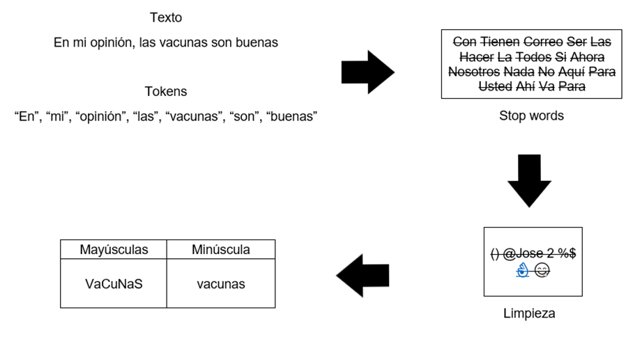
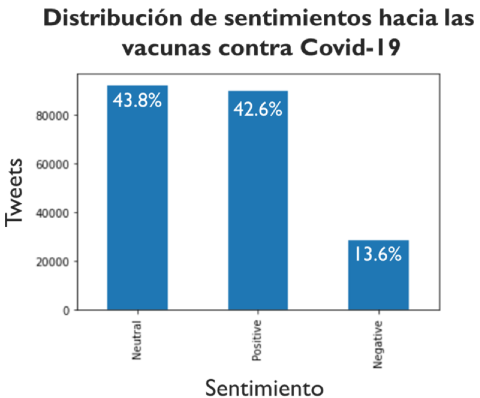
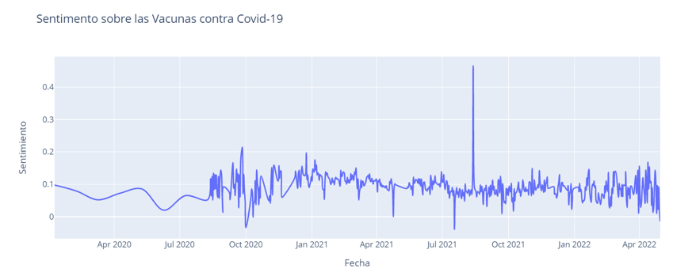
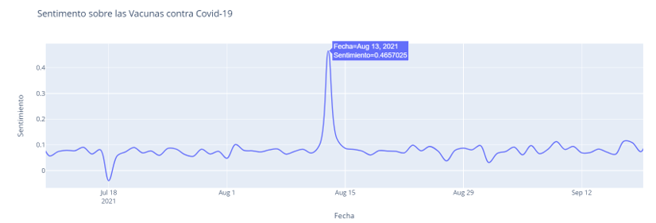

# **Introduction**

Social media has become a key platform for discussions on global issues, and the Covid-19 pandemic was no exception. Millions of users shared their opinions on Twitter regarding Covid-19 vaccines, ranging from strong approval to skepticism and misinformation. To understand these opinions better, I conducted a **Twitter Covid Vaccine Sentiment Analysis** using **Natural Language Processing (NLP)** for an assignment during my bachelor's degree.

This project aimed to explore how the public reacted to Covid-19 vaccines over time, which vaccines were more favored, and how misinformation played a role in shaping discussions. In this blog, I’ll walk you through the **data collection process, sentiment analysis techniques, and key insights** obtained from over **614,000 tweets** related to Covid-19 vaccines.

---

# **Data Collection & Preprocessing**

## **1. Data Source**
The dataset was obtained from **Kaggle**, which contained tweets about Covid-19 vaccines collected by different users. The dataset consisted of two main sources:

- **Covid Vaccine Tweets**
- **COVID-19 All Vaccines Tweets**

These datasets were merged, resulting in a final dataset of **614,074 tweets** spanning from **January 2020 to April 2022**. The dataset provided an extensive snapshot of public sentiment throughout different stages of the pandemic, including vaccine development, approvals, and rollouts.

<div style="overflow-x: auto;">
<table border="1" class="dataframe"><thead><tr style="text-align: right;"><th></th><th>id</th><th>user_name</th><th>user_location</th><th>user_description</th><th>user_created</th><th>user_followers</th><th>user_friends</th><th>user_favourites</th><th>user_verified</th><th>date</th><th>text</th><th>hashtags</th><th>source</th><th>retweets</th><th>favorites</th><th>is_retweet</th></tr></thead><tbody><tr><th>0</th><td>1340539111971516416</td><td>Rachel Roh</td><td>La Crescenta-Montrose, CA</td><td>Aggregator of Asian American news; scanning diverse sources 24/7/365. RT\'s, Follows and \'Likes\' will fuel me 👩\u200d💻</td><td>2009-04-08 17:52:46</td><td>405</td><td>1692</td><td>3247</td><td>False</td><td>2020-12-20 06:06:44</td><td>Same folks said daikon paste could treat a cytokine storm #PfizerBioNTech https://t.co/xeHhIMg1kF</td><td>[\'PfizerBioNTech\']</td><td>Twitter for Android</td><td>0</td><td>0</td><td>False</td></tr><tr><th>1</th><td>1338158543359250433</td><td>Albert Fong</td><td>San Francisco, CA</td><td>Marketing dude, tech geek, heavy metal &amp; \'80s music junkie. Fascinated by meteorology and all things in the cloud. Opinions are my own.</td><td>2009-09-21 15:27:30</td><td>834</td><td>666</td><td>178</td><td>False</td><td>2020-12-13 16:27:13</td><td>While the world has been on the wrong side of history this year, hopefully, the biggest vaccination effort we\'ve ev… https://t.co/dlCHrZjkhm</td><td>NaN</td><td>Twitter Web App</td><td>1</td><td>1</td><td>False</td></tr></tbody></table></div>


## **2. Preprocessing Steps**

Before applying sentiment analysis, the data underwent extensive **cleaning and transformation** to remove noise and standardize text for analysis. The following steps were implemented:

- **Eliminating Duplicate Tweets and Bot-Generated Content**: To avoid skewing results.
- **Removing URLs, mentions, and hashtags** to focus only on the textual content.
- **Tokenization**: Splitting sentences into individual words.
- **Lemmatization**: Converting words to their base forms (e.g., “running” → “run”).
- **Removing Stop Words**: Filtering out common words like “the,” “and,” and “is” that don’t contribute to sentiment.
- **Handling Special Characters and Emojis**: Converting emojis into text representations to retain sentiment.

For these tasks, Python libraries such as **TextBlob, NLTK, pandas, and NeatText** were used. The goal was to create a dataset that accurately reflects human sentiment without irrelevant data points affecting the results. After cleaning the data, the resulting dataset consist of **482,523 tweets**.



---

# **Sentiment Analysis Methodology**

## **1. Sentiment Classification**

Each tweet was classified into one of three sentiment categories:

- **Positive**: Favorable opinions about Covid-19 vaccines.
- **Neutral**: Informational or non-opinionated tweets.
- **Negative**: Skepticism, misinformation, or distrust toward vaccines.

This classification was done using **TextBlob**, a Python library that assigns **polarity scores** to text:

- **Polarity** ranges from **-1 (negative) to +1 (positive)**.
- A polarity score **>0** is considered positive, **<0** is negative, and **0 is neutral**.

## **2. Subjectivity Analysis**

We also measured **subjectivity**, which determines how factual vs. opinionated a tweet is. Subjectivity scores helped distinguish factual news reports from personal opinions, allowing us to see how much of the vaccine discourse was based on emotions rather than verifiable facts.


## Sentiment Analysis with TextBlob

This Python function leverages the TextBlob library to analyze the sentiment of a given text input. It returns a dictionary containing the polarity, subjectivity, and overall sentiment classification of the text.

```python
from textblob import TextBlob

def analyze_sentiment(text):

    analysis = TextBlob(text)
    polarity = analysis.sentiment.polarity
    subjectivity = analysis.sentiment.subjectivity

    if polarity > 0:
        sentiment = 'Positive'
    elif polarity == 0:
        sentiment = 'Neutral'
    else:
        sentiment = 'Negative'

    result = {
        'polarity': polarity,
        'subjectivity': subjectivity,
        'sentiment': sentiment
    }

    return result
```
---

# **Key Findings**

## **1. Overall Sentiment Distribution**



The dataset showed the following sentiment distribution:

- **42.6% Positive**
- **43.8% Neutral**
- **13.6% Negative**

This indicates that while the majority of tweets were neutral, positive sentiment toward vaccines slightly outweighed negative sentiment. This is an encouraging insight, showing that, despite vaccine hesitancy and misinformation, social media users were largely supportive or at least informative about vaccines.

## **2. Vaccine-Specific Sentiment**

The sentiment scores for different vaccines were as follows:

| Vaccine     | Polarity | Subjectivity |
| ----------- | -------- | ------------ |
| Pfizer      | 0.1163   | 0.3176       |
| AstraZeneca | 0.114    | 0.2685       |
| Sputnik     | 0.1082   | 0.3041       |
| Covaxin     | 0.1080   | 0.2541       |
| Moderna     | 0.1047   | 0.2954       |

- **Pfizer** had the highest acceptance based on polarity.
- **Moderna** had the lowest polarity but was still **above 0**, indicating positive sentiment overall.
- **Covaxin** had the lowest subjectivity, meaning more objective statements were made about it.

These results reflect how different vaccines were received by the public and provide insights into brand trust and perception.

## **3. Time-Series Analysis of Sentiment**





Analyzing sentiment over time revealed key trends:

- Early **2020** had **low tweet activity** about vaccines due to the lack of available information.
- Sentiment **spiked in December 2020**, aligning with the release of **Pfizer’s vaccine** under EUA.
- The **highest spike in sentiment occurred in August 2021**, coinciding with the **approval of the third dose** in the U.S.

## **4. Most Common Words in Sentiment Categories**

Using **word clouds**, we identified frequently used words in different sentiment categories:

### **Positive Words:**
- Vaccine, Efficient, Thankful, Safe, Amazing, Voluntary

### **Negative Words:**
- Dangerous, Scared, Misinformation, Side-effects, Risky

### **Neutral Words:**
- Vaccine, Doses, Health, Available, Announcement

---

# **Challenges & Limitations**

While the analysis provided valuable insights, it also faced some limitations:

- **Bias in Twitter Data**: The dataset may not represent the global population’s opinion.
- **Irony & Sarcasm Detection**: Some tweets with sarcasm may have been misclassified.
- **Bot-Generated Tweets**: Despite filtering, some automated tweets could have influenced results.

---

# **Conclusion & Takeaways**

This project provided a **data-driven perspective on public sentiment toward Covid-19 vaccines**, highlighting key trends and reactions. The main takeaways are:

- Public sentiment was **largely neutral to positive**.
- **Pfizer** had the most positive perception among vaccines.
- Sentiment **spiked during key vaccine approval milestones**.

Understanding public opinion is crucial for **public health campaigns**, combating misinformation, and improving vaccine distribution strategies. Future improvements could include **deep learning sentiment models** and **real-time analysis of vaccine perception.**

---

Thank you for reading! If you have any questions or comments, please feel free to contact me. Your feedback is highly appreciated.

---

**Keywords:** NLP, Sentiment Analysis, Covid, Machine Learning, Data Science

---